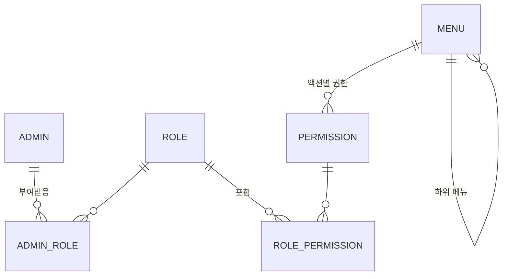

# 02. 접근제어 모델

관리자관리, 관리자 권한관리, 관리자 역할관리, 메뉴 동적관리 4개 기능은 하나의 접근제어 구조를 이룬다.
이 문서는 그 구조와 규칙을 정의한다. 다른 모든 기능은 이 모델 위에서 동작한다.

## 1. 기본 구조



- **관리자 → 역할**: 관리자 한 명은 역할을 여러 개 가질 수 있다 (N : M).
- **역할 → 권한**: 역할 하나는 권한을 여러 개 묶는다 (N : M).
- **권한 = 메뉴 × 액션**: 예를 들어 "사용자관리" 메뉴에는 "사용자관리-조회", "사용자관리-수정" 같은 권한이 있다.
- **권한은 관리자에게 직접 부여하지 않는다.** 반드시 역할을 통해 부여한다.

### 관리자의 최종 권한 계산

관리자가 가진 모든 역할의 권한을 **합집합**으로 계산한다.

```
관리자 A의 역할: [회원운영자, 조회전용]
  회원운영자 권한: 사용자관리-조회, 사용자관리-수정
  조회전용   권한: 사용자관리-조회, 게시판관리-조회
→ 최종 권한: 사용자관리-조회, 사용자관리-수정, 게시판관리-조회
```

"권한 거부(deny)" 개념은 두지 않는다. 권한은 더하기만 가능하다.

데이터 범위 권한(관리자별로 특정 기업 데이터만 관리)은 이번 범위에서 제외한다. 권한이 있으면 해당 메뉴의 모든 데이터에 접근한다.

게시판 단위 권한(예: 공지사항만 관리)은 데이터 범위 권한이 아니라, 게시판마다 별도 메뉴를 두는 **게시판별 메뉴 권한**으로 구현한다. 권한 모델(메뉴 × 액션)은 그대로다 ([ADR-0010](adr/0010-per-board-menus.md)).

## 2. 액션 정의

| 코드 | 이름 | 설명 | 예시 |
|---|---|---|---|
| `READ` | 조회 | 목록·상세 조회. 메뉴 노출의 기준 | 사용자 목록 보기 |
| `CREATE` | 등록 | 신규 데이터 등록 | 게시글 작성, 기업 등록 |
| `UPDATE` | 수정 | 데이터 수정, 상태 변경 | 회원 정지, 코드 수정 |
| `DELETE` | 삭제 | 데이터 삭제 | 게시글 삭제 |
| `EXCEL` | 엑셀 | 목록 엑셀 다운로드 | 회원 목록 다운로드 |
| `PRIVACY` | 개인정보열람 | 마스킹 해제 후 원문 보기 | 회원 휴대폰 번호 원문 보기 |

### 액션 규칙

- `CREATE`, `UPDATE`, `DELETE`, `EXCEL`, `PRIVACY`는 같은 메뉴의 `READ`가 있어야 의미가 있다. 역할에 이 권한들을 넣을 때 `READ`를 자동으로 함께 넣는다.
- 메뉴마다 쓰는 액션이 다르다. 메뉴 등록 시 **사용할 액션을 선택**하고, 선택한 액션만큼 권한이 생긴다.
  - 예: "코드관리"는 `READ`, `CREATE`, `UPDATE`, `DELETE`만 사용하고, `EXCEL`과 `PRIVACY`는 사용하지 않는다.
- `PRIVACY` 권한으로 원문을 볼 때마다 감사로그를 남긴다 ([07-nonfunctional.md](07-nonfunctional.md) 3.2).

## 3. 메뉴와 권한의 관계

### 3.1 메뉴 구조

```
시스템관리 (폴더 메뉴)
 ├─ 메뉴관리      (화면 메뉴, URL: /system/menus)
 ├─ 코드관리      (화면 메뉴, URL: /system/codes)
 └─ 관리자관리    (폴더 메뉴)
     ├─ 관리자    (화면 메뉴)
     ├─ 역할      (화면 메뉴)
     └─ 권한      (화면 메뉴)
```

| 메뉴 종류 | 설명 | 권한 |
|---|---|---|
| 폴더 메뉴 | 하위 메뉴를 묶기만 한다. 화면 없음 | 없음 |
| 화면 메뉴 | 실제 화면(URL)이 있다 | 선택한 액션만큼 생성 |

- 메뉴 트리는 최대 3단계까지 만들 수 있다.
- 권한은 "역할관리"(역할 기준)와 "권한관리"(메뉴 기준) 두 화면에서 같은 데이터를 다른 방향으로 보고 고친다 ([04-features/07-permission.md](04-features/07-permission.md)).

### 3.2 메뉴 노출 규칙

- 화면 메뉴는 관리자에게 그 메뉴의 `READ` 권한이 있으면 노출한다.
- 폴더 메뉴는 하위에 노출되는 화면 메뉴가 하나라도 있으면 노출한다.
- 메뉴의 "사용 여부"가 `N`이면 권한과 상관없이 노출하지 않고, 접근도 차단한다.

### 3.3 메뉴 변경 시 권한 처리

| 상황 | 처리 |
|---|---|
| 화면 메뉴 등록 | 선택한 액션만큼 권한 자동 생성 |
| 메뉴에 액션 추가 | 해당 권한 생성. 기존 역할에는 자동 부여하지 않는다 |
| 메뉴에서 액션 제거 | 해당 권한과 역할 매핑 삭제 |
| 메뉴 삭제 | 하위 메뉴가 있으면 삭제 불가. 없으면 권한과 역할 매핑까지 함께 삭제 |

## 4. 서버 권한 체크

권한은 **서버에서 반드시 체크**한다. 프론트에서 버튼을 숨기는 것은 편의 기능일 뿐이다.

- 모든 API와 JSP 컨트롤러 메서드에 필요한 권한(메뉴 + 액션)을 지정한다.
  - 예: `@RequirePermission(menu = "USER", action = UPDATE)`
- 공통 인터셉터(또는 AOP)가 요청 전에 로그인 관리자의 최종 권한에 포함되는지 확인한다.
- 최종 권한은 캐시하고, 역할·권한·메뉴·관리자 역할이 바뀌면 캐시를 비운다. 그래서 권한 변경은 이미 로그인한 관리자에게도 다음 요청부터 바로 반영된다 ([08-architecture.md](08-architecture.md) 6절).
- 권한이 없으면:
  - REST API(①, ②): `403` 응답과 공통 에러 포맷
  - JSP SSR(③): 권한 없음 안내 페이지
- 게시글 관리처럼 여러 메뉴 중 하나의 권한만 있어도 되는 기능은, 메뉴를 여러 개 지정하고 그중 하나라도 있으면 통과시킨다.
  - 예: `@RequirePermission(menu = {"POST", "POST_{boardCd}"}, action = UPDATE)`
- 권한 지정이 없는 컨트롤러 메서드는 **기본 거부**한다. 로그인·로그아웃·내 정보처럼 로그인만 필요한 기능은 명시적으로 예외 처리한다.

### 프론트의 역할

- 로그인 후 서버에서 **내 메뉴 트리**와 **내 권한 목록**을 받아 메뉴 노출과 버튼 활성·비활성에 사용한다. 권한이 없는 메뉴는 숨기고, 권한이 없는 버튼은 비활성으로 보여 준다.
- 프론트 3종 모두 같은 기준으로 노출을 제어한다.

## 5. 보호 규칙

관리자 계정과 권한 설정을 잘못 바꿔서 시스템이 잠기는 일을 막기 위한 규칙이다.

| No | 규칙 | 설명 |
|---|---|---|
| R1 | 슈퍼관리자 역할은 권한 체크 예외 | 모든 메뉴·액션에 접근 가능. 새 메뉴가 생겨도 자동으로 포함 |
| R2 | 시스템 역할은 삭제·수정 불가 | 슈퍼관리자 역할은 "시스템 역할"로 표시하며 이름·권한을 바꿀 수 없다 |
| R3 | 마지막 슈퍼관리자 보호 | 사용 중인 슈퍼관리자가 1명뿐이면 그 관리자의 삭제, 잠금, 슈퍼관리자 역할 회수 불가 |
| R4 | 자기 자신의 역할 변경 불가 | 관리자는 본인 계정의 역할을 추가·삭제할 수 없다 |
| R5 | 권한 상향 금지 | 관리자는 본인이 가진 권한 범위 안에서만 역할을 만들거나 부여할 수 있다 (슈퍼관리자 제외) |
| R6 | 사용 중인 역할 삭제 제한 | 관리자에게 부여된 역할은 삭제할 수 없다. 먼저 부여를 해제해야 한다 |
| R7 | 변경 이력 기록 | 역할 부여·회수, 역할의 권한 변경은 모두 감사로그에 남긴다 |

## 6. 권한 매트릭스 예시

초기 역할 구성 예시다. ● = 부여, - = 미부여, (빈칸) = 해당 메뉴에서 사용하지 않는 액션.

| 메뉴 | 액션 | 시스템관리자 | 회원운영자 | 콘텐츠운영자 | 조회전용 |
|---|---|---|---|---|---|
| 기업정보관리 | READ / CREATE / UPDATE / DELETE / EXCEL | - | ● ● ● - ● | - | ● - - - - |
| 사용자관리 | READ / CREATE / UPDATE / DELETE / EXCEL / PRIVACY | - | ● ● ● - ● ● | - | ● - - - - - |
| 게시판 관리 | READ / CREATE / UPDATE / DELETE | ● ● ● ● | - | ● - - - | ● - - - |
| 통합 게시글 관리 | READ / CREATE / UPDATE / DELETE | - | - | ● ● ● ● | ● - - - |
| 게시판별 게시글 관리 | READ / CREATE / UPDATE / DELETE | - | - | - | - |
| 코드관리 | READ / CREATE / UPDATE / DELETE | ● ● ● ● | ● - - - | ● - - - | - |
| 메뉴관리 | READ / CREATE / UPDATE / DELETE | ● ● ● ● | - | - | - |
| 관리자관리 | READ / CREATE / UPDATE / DELETE | ● ● ● ● | - | - | - |
| 역할관리 | READ / CREATE / UPDATE / DELETE | ● ● ● ● | - | - | - |
| 권한관리 | READ / UPDATE | ● ● | - | - | - |
| 마스킹 설정 | READ / UPDATE | ● ● | - | - | - |
| 감사로그 | READ / EXCEL | ● ● | - | - | ● - |

> 슈퍼관리자는 R1에 따라 표에 넣지 않는다.
> 게시판별 게시글 관리 메뉴는 "공지사항만 관리하는 운영자"처럼 게시판 단위로 권한을 줄 때 쓴다 ([04-features/05-board.md](04-features/05-board.md)).

## 7. 미결 사항

없음.
