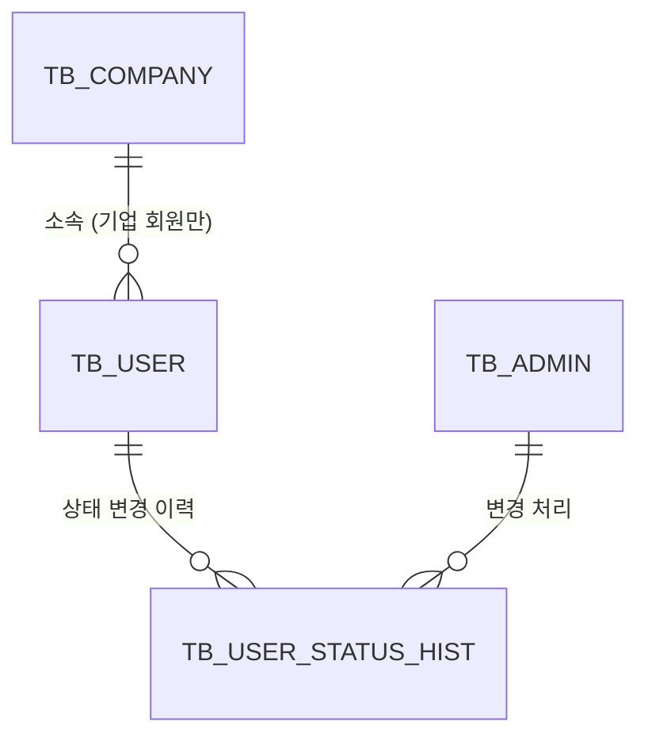
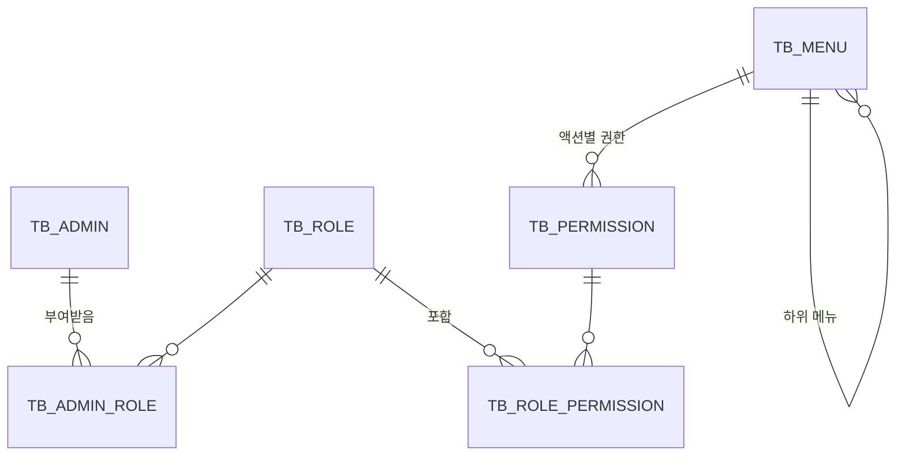
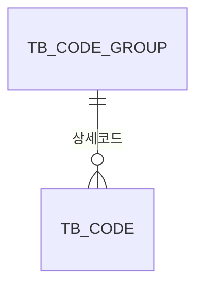
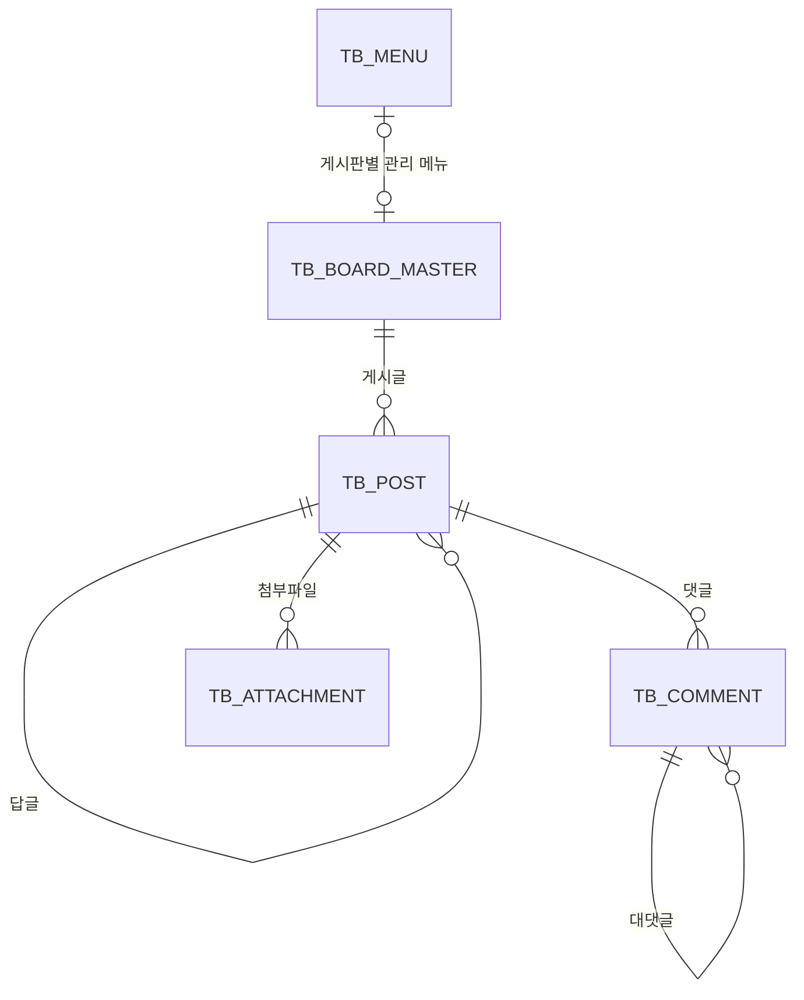
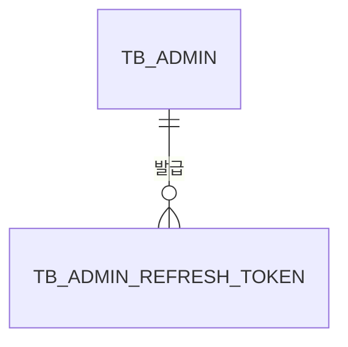
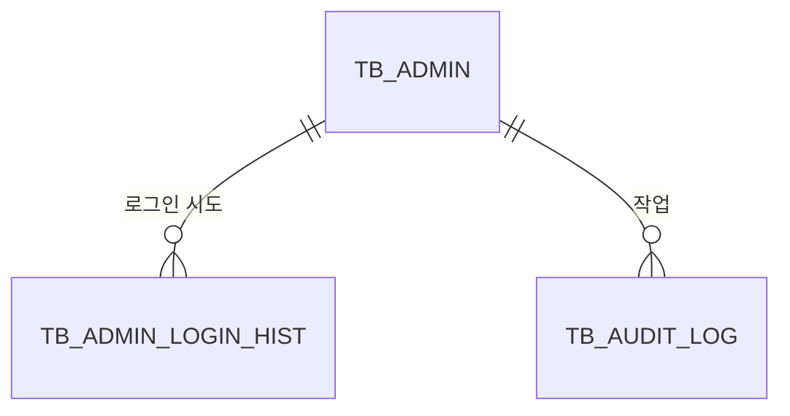

# 03. 도메인 / ERD

관리자 서비스가 다루는 데이터 구조를 정의한다.
DB는 **PostgreSQL**을 사용하며, 데이터 타입은 PostgreSQL 기준으로 적는다.

- 일시는 `TIMESTAMP`, 긴 문자열은 `TEXT`, JSON 데이터는 `JSONB`를 쓴다.
- 문서에서는 테이블·칼럼 이름을 대문자로 적지만, PostgreSQL은 따옴표 없는 이름을 소문자로 저장하므로 실제 DDL은 소문자(`tb_admin_role`)로 작성한다.

## 0. 이 문서의 전제

| No | 결정 사항 | 영향 받는 테이블 |
|---|---|---|
| D1 | 기업은 승인 절차 없이 등록하고, 상태(정상/정지)만 관리한다 | `TB_COMPANY` |
| D2 | 소속 회원이 있는 기업은 삭제할 수 없다 | `TB_COMPANY` |
| D3 | 게시판은 사용자 서비스에도 노출되어 회원이 사용한다. 작성자는 회원 또는 관리자다 | `TB_POST`, `TB_COMMENT` |
| D4 | QnA는 답글과 재답글이 가능한 계층형 구조로 한다. 답글은 원글 작성자와 관리자만 달 수 있다 | `TB_POST` |
| D5 | 데이터 범위 권한(특정 기업만 관리 등)은 이번 범위에서 제외한다 | (관련 테이블 없음) |
| D6 | 슈퍼관리자는 권한 체크 예외로 처리한다 ([02-access-model.md](02-access-model.md) R1) | `TB_ROLE` |

## 1. 설계 규칙

### 1.1 명명 규칙

- 테이블: `TB_` + 대문자 스네이크 케이스. 예: `TB_ADMIN_ROLE`
- 칼럼: 대문자 스네이크 케이스. 자주 쓰는 접미어는 아래와 같다.

| 접미어 | 의미 | 예 |
|---|---|---|
| `_ID` | 식별자 | `ADMIN_ID` |
| `_CD` | 코드값 (코드관리의 상세코드) | `STATUS_CD` |
| `_NM` | 이름 | `COMPANY_NM` |
| `_YN` | 여부 (`Y` / `N`) | `USE_YN` |
| `_DT` | 일시 | `REG_DT` |
| `_CNT` | 개수 | `VIEW_CNT` |

### 1.2 기본키

- 일반 테이블은 대리키(`BIGINT GENERATED ALWAYS AS IDENTITY`)를 쓴다.
- 코드 테이블은 코드값 자체를 키로 쓴다 (`GROUP_CD`, `GROUP_CD + CODE`).
- 매핑 테이블(N : M)은 두 외래키를 묶어 복합키로 쓴다.

### 1.3 공통 칼럼

업무 테이블에는 아래 칼럼을 공통으로 둔다. 로그 테이블은 등록 정보만 둔다.

| 칼럼 | 타입 | 설명 |
|---|---|---|
| `REG_ID` | BIGINT | 등록한 관리자 ID |
| `REG_DT` | TIMESTAMP | 등록 일시 |
| `MOD_ID` | BIGINT | 마지막으로 수정한 관리자 ID |
| `MOD_DT` | TIMESTAMP | 마지막 수정 일시 |

> 회원이 사용자 서비스에서 작성한 데이터(게시글 등)는 `REG_ID`가 비고, 작성자를 별도 칼럼(`WRITER_TYPE_CD`, `WRITER_ID`)으로 구분한다.

### 1.4 삭제 방식

| 대상 | 방식 | 이유 |
|---|---|---|
| 기업, 게시판, 게시글, 댓글 | 삭제 표시 (`DEL_YN = 'Y'`) | 복구와 이력 확인 |
| 회원 | 탈퇴는 상태를 "탈퇴"로 변경. 관리자 삭제는 삭제 표시 (`DEL_YN = 'Y'`) | 탈퇴·삭제 후에도 개인정보를 기간 제한 없이 보관 ([07-nonfunctional.md](07-nonfunctional.md) NF-PI-22), 작성한 게시글 유지 |
| 관리자 | 삭제하지 않고 상태를 "사용중지"로 변경 | 감사로그의 작성자 추적 |
| 매핑 테이블 (관리자-역할, 역할-권한) | 실제 삭제 | 변경 이력은 감사로그에 남김 |
| 로그 테이블 | 수정·삭제 불가 | 보존 기간(감사로그 2년, 로그인 이력 1년)이 지나면 배치로 정리 ([07-nonfunctional.md](07-nonfunctional.md) 5절) |

## 2. 전체 구성

| 도메인 | 테이블 |
|---|---|
| 회원 | `TB_COMPANY`, `TB_USER`, `TB_USER_STATUS_HIST` |
| 관리자·접근제어 | `TB_ADMIN`, `TB_ROLE`, `TB_ADMIN_ROLE`, `TB_MENU`, `TB_PERMISSION`, `TB_ROLE_PERMISSION` |
| 코드·설정 | `TB_CODE_GROUP`, `TB_CODE`, `TB_MASKING_POLICY` |
| 게시판 | `TB_BOARD_MASTER`, `TB_POST`, `TB_COMMENT`, `TB_ATTACHMENT` |
| 인증 | `TB_ADMIN_REFRESH_TOKEN` |
| 로그 | `TB_ADMIN_LOGIN_HIST`, `TB_AUDIT_LOG` |

## 3. 회원 도메인



### TB_COMPANY (기업)

| 칼럼 | 타입 | 필수 | 설명 |
|---|---|---|---|
| `COMPANY_ID` | BIGINT | PK | 기업 ID |
| `COMPANY_NM` | VARCHAR(100) | Y | 기업명 |
| `BIZ_REG_NO` | VARCHAR(10) | Y | 사업자등록번호 (숫자 10자리, 중복 불가) |
| `CEO_NM` | VARCHAR(50) | Y | 대표자명 |
| `BIZ_TYPE` | VARCHAR(100) | | 업태 |
| `BIZ_ITEM` | VARCHAR(100) | | 종목 |
| `TEL_NO` | VARCHAR(20) | | 대표 전화번호 |
| `ZIP_CD` | VARCHAR(5) | | 우편번호 |
| `ADDR` | VARCHAR(200) | | 주소 |
| `ADDR_DTL` | VARCHAR(200) | | 상세주소 |
| `STATUS_CD` | VARCHAR(20) | Y | 기업 상태 (코드 그룹 `COMPANY_STATUS`) |
| `DEL_YN` | CHAR(1) | Y | 삭제 여부 |
| 공통 칼럼 | | | |

- 소속 기업 회원이 있는 기업은 삭제할 수 없다 (D2). 탈퇴한 회원도 소속 회원으로 본다.

### TB_USER (회원)

| 칼럼 | 타입 | 필수 | 설명 |
|---|---|---|---|
| `USER_ID` | BIGINT | PK | 회원 ID |
| `LOGIN_ID` | VARCHAR(50) | Y | 로그인 아이디 (중복 불가) |
| `PASSWORD` | VARCHAR(200) | Y | 비밀번호 해시. 관리자 서비스에서는 조회·표시하지 않는다 |
| `PWD_TEMP_YN` | CHAR(1) | Y | 임시 비밀번호 여부. 관리자가 등록·초기화하면 `Y` (사용자 서비스에서 변경 강제) |
| `USER_TYPE_CD` | VARCHAR(20) | Y | 회원 구분: 개인 / 기업 (코드 그룹 `USER_TYPE`) |
| `COMPANY_ID` | BIGINT | | 소속 기업. 기업 회원이면 필수, 개인 회원이면 비움 |
| `USER_NM` | VARCHAR(50) | Y | 이름 (개인정보) |
| `EMAIL` | VARCHAR(100) | Y | 이메일 (개인정보) |
| `MOBILE_NO` | VARCHAR(20) | | 휴대폰 번호 (개인정보) |
| `BIRTH_DATE` | DATE | | 생년월일 (개인정보) |
| `DEPT_NM` | VARCHAR(100) | | 부서명 (기업 회원) |
| `POSITION_NM` | VARCHAR(50) | | 직위 (기업 회원) |
| `STATUS_CD` | VARCHAR(20) | Y | 회원 상태: 정상 / 휴면 / 정지 / 탈퇴 (코드 그룹 `USER_STATUS`) |
| `JOIN_DT` | TIMESTAMP | Y | 가입 일시 |
| `LAST_LOGIN_DT` | TIMESTAMP | | 마지막 로그인 일시 (사용자 서비스 기준) |
| `WITHDRAW_DT` | TIMESTAMP | | 탈퇴 일시 |
| `DEL_YN` | CHAR(1) | Y | 삭제 여부 (관리자 삭제) |
| 공통 칼럼 | | | |

- 개인정보 칼럼의 마스킹 여부는 `TB_MASKING_POLICY` 설정을 따른다. 마스킹된 항목은 `PRIVACY` 권한이 있을 때만 원문을 보여 준다 ([02-access-model.md](02-access-model.md)).
- 회원 가입 경로는 `REG_ID`로 구분한다. 비어 있으면 사용자 서비스 가입, 값이 있으면 관리자 등록이다.
- 개인정보 칼럼은 DB에 암호화하지 않고 저장한다 ([07-nonfunctional.md](07-nonfunctional.md) NF-PI-03).

### TB_USER_STATUS_HIST (회원 상태 변경 이력)

| 칼럼 | 타입 | 필수 | 설명 |
|---|---|---|---|
| `HIST_ID` | BIGINT | PK | 이력 ID |
| `USER_ID` | BIGINT | Y | 회원 ID |
| `BEFORE_STATUS_CD` | VARCHAR(20) | Y | 변경 전 상태 |
| `AFTER_STATUS_CD` | VARCHAR(20) | Y | 변경 후 상태 |
| `REASON` | VARCHAR(500) | Y | 변경 사유 (정지·탈퇴 처리 시 필수) |
| `REG_ID` | BIGINT | | 처리한 관리자 ID (시스템 처리, 예: 휴면 전환은 비움) |
| `REG_DT` | TIMESTAMP | Y | 처리 일시 |

## 4. 관리자·접근제어 도메인



### TB_ADMIN (관리자)

| 칼럼 | 타입 | 필수 | 설명 |
|---|---|---|---|
| `ADMIN_ID` | BIGINT | PK | 관리자 ID |
| `LOGIN_ID` | VARCHAR(50) | Y | 로그인 아이디 (중복 불가) |
| `PASSWORD` | VARCHAR(200) | Y | 비밀번호 해시 |
| `ADMIN_NM` | VARCHAR(50) | Y | 이름 |
| `EMAIL` | VARCHAR(100) | Y | 이메일 |
| `MOBILE_NO` | VARCHAR(20) | | 휴대폰 번호 |
| `DEPT_NM` | VARCHAR(100) | | 부서명 |
| `STATUS_CD` | VARCHAR(20) | Y | 관리자 상태: 사용 / 잠금 / 사용중지 (코드 그룹 `ADMIN_STATUS`) |
| `PWD_TEMP_YN` | CHAR(1) | Y | 임시 비밀번호 여부. `Y`면 로그인 후 비밀번호 변경 강제 |
| `LOGIN_FAIL_CNT` | INT | Y | 연속 로그인 실패 횟수 |
| `LAST_LOGIN_DT` | TIMESTAMP | | 마지막 로그인 일시 |
| `PWD_CHANGED_DT` | TIMESTAMP | | 비밀번호 변경 일시 (홈 화면 표시용) |
| 공통 칼럼 | | | |

### TB_ROLE (역할)

| 칼럼 | 타입 | 필수 | 설명 |
|---|---|---|---|
| `ROLE_ID` | BIGINT | PK | 역할 ID |
| `ROLE_CD` | VARCHAR(50) | Y | 역할 코드 (중복 불가). 예: `SUPER_ADMIN` |
| `ROLE_NM` | VARCHAR(100) | Y | 역할명 |
| `DESCRIPTION` | VARCHAR(500) | | 설명 |
| `SYSTEM_YN` | CHAR(1) | Y | 시스템 역할 여부. `Y`면 수정·삭제 불가 (R2) |
| `USE_YN` | CHAR(1) | Y | 사용 여부 |
| 공통 칼럼 | | | |

### TB_ADMIN_ROLE (관리자-역할 매핑)

| 칼럼 | 타입 | 필수 | 설명 |
|---|---|---|---|
| `ADMIN_ID` | BIGINT | PK | 관리자 ID |
| `ROLE_ID` | BIGINT | PK | 역할 ID |
| `REG_ID` | BIGINT | Y | 부여한 관리자 ID |
| `REG_DT` | TIMESTAMP | Y | 부여 일시 |

### TB_MENU (메뉴)

| 칼럼 | 타입 | 필수 | 설명 |
|---|---|---|---|
| `MENU_ID` | BIGINT | PK | 메뉴 ID |
| `PARENT_MENU_ID` | BIGINT | | 상위 메뉴 ID (최상위면 비움) |
| `MENU_CD` | VARCHAR(50) | Y | 메뉴 코드 (중복 불가). 서버 권한 체크에서 쓴다. 예: `USER` |
| `MENU_NM` | VARCHAR(100) | Y | 메뉴명 |
| `MENU_TYPE_CD` | VARCHAR(20) | Y | 폴더 / 화면 (코드 그룹 `MENU_TYPE`) |
| `MENU_URL` | VARCHAR(200) | | 화면 URL (화면 메뉴만) |
| `DEPTH` | INT | Y | 깊이 (1부터 시작) |
| `SORT_ORD` | INT | Y | 같은 상위 메뉴 안에서의 정렬 순서 |
| `ICON` | VARCHAR(50) | | 메뉴 아이콘 이름 |
| `USE_YN` | CHAR(1) | Y | 사용 여부. `N`이면 노출·접근 모두 차단 |
| `SYSTEM_YN` | CHAR(1) | Y | 시스템 메뉴 여부. `Y`면 삭제·사용 안 함 불가 (메뉴관리, 관리자관리 등) |
| 공통 칼럼 | | | |

### TB_PERMISSION (권한)

| 칼럼 | 타입 | 필수 | 설명 |
|---|---|---|---|
| `PERM_ID` | BIGINT | PK | 권한 ID |
| `MENU_ID` | BIGINT | Y | 메뉴 ID |
| `ACTION_CD` | VARCHAR(20) | Y | 액션: `READ` / `CREATE` / `UPDATE` / `DELETE` / `EXCEL` / `PRIVACY` (코드 그룹 `ACTION`) |
| `REG_DT` | TIMESTAMP | Y | 생성 일시 |

- `MENU_ID + ACTION_CD`는 중복 불가.
- 권한은 메뉴 등록·수정 시 자동으로 생성·삭제된다 ([02-access-model.md](02-access-model.md) 3.3).

### TB_ROLE_PERMISSION (역할-권한 매핑)

| 칼럼 | 타입 | 필수 | 설명 |
|---|---|---|---|
| `ROLE_ID` | BIGINT | PK | 역할 ID |
| `PERM_ID` | BIGINT | PK | 권한 ID |
| `REG_ID` | BIGINT | Y | 부여한 관리자 ID |
| `REG_DT` | TIMESTAMP | Y | 부여 일시 |

## 5. 코드·설정 도메인



### TB_CODE_GROUP (그룹코드)

| 칼럼 | 타입 | 필수 | 설명 |
|---|---|---|---|
| `GROUP_CD` | VARCHAR(50) | PK | 그룹코드. 예: `USER_STATUS` |
| `GROUP_NM` | VARCHAR(100) | Y | 그룹코드명 |
| `DESCRIPTION` | VARCHAR(500) | | 설명 |
| `SYSTEM_YN` | CHAR(1) | Y | 시스템 코드 여부. `Y`면 삭제 불가 (프로그램이 직접 참조하는 코드) |
| `USE_YN` | CHAR(1) | Y | 사용 여부 |
| 공통 칼럼 | | | |

### TB_CODE (상세코드)

| 칼럼 | 타입 | 필수 | 설명 |
|---|---|---|---|
| `GROUP_CD` | VARCHAR(50) | PK | 그룹코드 |
| `CODE` | VARCHAR(50) | PK | 상세코드. 예: `SUSPENDED` |
| `CODE_NM` | VARCHAR(100) | Y | 상세코드명. 예: 정지 |
| `SORT_ORD` | INT | Y | 정렬 순서 |
| `DESCRIPTION` | VARCHAR(500) | | 설명 |
| `USE_YN` | CHAR(1) | Y | 사용 여부 |
| 공통 칼럼 | | | |

### 초기 코드 그룹

이 문서의 테이블이 참조하는 코드 그룹이다. `PRIVACY_REASON`을 뺀 나머지는 시스템 코드(`SYSTEM_YN = 'Y'`)로 등록한다.

| 그룹코드 | 이름 | 상세코드 |
|---|---|---|
| `COMPANY_STATUS` | 기업 상태 | `ACTIVE` 정상, `SUSPENDED` 정지 |
| `USER_TYPE` | 회원 구분 | `PERSONAL` 개인, `CORPORATE` 기업 |
| `USER_STATUS` | 회원 상태 | `ACTIVE` 정상, `DORMANT` 휴면, `SUSPENDED` 정지, `WITHDRAWN` 탈퇴 |
| `ADMIN_STATUS` | 관리자 상태 | `ACTIVE` 사용, `LOCKED` 잠금, `DISABLED` 사용중지 |
| `MENU_TYPE` | 메뉴 종류 | `FOLDER` 폴더, `PAGE` 화면 |
| `ACTION` | 액션 | `READ`, `CREATE`, `UPDATE`, `DELETE`, `EXCEL`, `PRIVACY` |
| `BOARD_TYPE` | 게시판 유형 | `NOTICE` 공지, `FAQ`, `QNA`, `INQUIRY` 1:1문의, `GENERAL` 일반 |
| `WRITER_TYPE` | 작성자 구분 | `USER` 회원, `ADMIN` 관리자 |
| `ANSWER_STATUS` | 답변 상태 | `WAITING` 답변대기, `ANSWERED` 답변완료 |
| `PRIVACY_FIELD` | 개인정보 항목 | `USER_NM` 이름, `EMAIL` 이메일, `MOBILE_NO` 휴대폰 번호, `BIRTH_DATE` 생년월일 |
| `PRIVACY_REASON` | 개인정보 열람 사유 (일반 코드, 관리자가 추가 가능) | `CS_INQUIRY` 고객 문의 응대, `IDENTITY_CHECK` 본인 확인, `DATA_CORRECTION` 정보 정정, `ETC` 기타 (직접 입력) |
| `AUTH_TYPE` | 인증 방식 | `SESSION` 세션, `TOKEN` 토큰 |
| `LOGIN_RESULT` | 로그인 결과 | `SUCCESS` 성공, `FAIL_PWD` 비밀번호 오류, `FAIL_LOCKED` 잠김 계정, `FAIL_DISABLED` 사용중지 계정, `FAIL_NO_ID` 없는 아이디 |

### TB_MASKING_POLICY (개인정보 마스킹 설정)

개인정보 항목별로 화면과 엑셀에서 마스킹할지 정한다 ([04-features/10-masking.md](04-features/10-masking.md)).

| 칼럼 | 타입 | 필수 | 설명 |
|---|---|---|---|
| `FIELD_CD` | VARCHAR(50) | PK | 개인정보 항목 (코드 그룹 `PRIVACY_FIELD`). 예: `MOBILE_NO` |
| `SCREEN_MASK_YN` | CHAR(1) | Y | 화면(목록·상세)에서 마스킹 |
| `EXCEL_MASK_YN` | CHAR(1) | Y | 엑셀 다운로드에서 마스킹 |
| `MOD_ID` | BIGINT | Y | 마지막으로 수정한 관리자 ID |
| `MOD_DT` | TIMESTAMP | Y | 마지막 수정 일시 |

## 6. 게시판 도메인



### TB_BOARD_MASTER (게시판 마스터)

| 칼럼 | 타입 | 필수 | 설명 |
|---|---|---|---|
| `BOARD_ID` | BIGINT | PK | 게시판 ID |
| `BOARD_CD` | VARCHAR(50) | Y | 게시판 코드 (중복 불가). 사용자 서비스가 게시판을 찾을 때 쓴다 |
| `BOARD_NM` | VARCHAR(100) | Y | 게시판명 |
| `BOARD_TYPE_CD` | VARCHAR(20) | Y | 게시판 유형 (코드 그룹 `BOARD_TYPE`) |
| `CATEGORY_GROUP_CD` | VARCHAR(50) | | 게시글 분류로 쓸 그룹코드 (예: FAQ 분류). 비우면 분류 없음 |
| `COMMENT_YN` | CHAR(1) | Y | 댓글 허용 |
| `ATTACH_YN` | CHAR(1) | Y | 첨부 허용 |
| `ATTACH_MAX_CNT` | INT | | 게시글당 최대 첨부 개수 |
| `ATTACH_MAX_SIZE_MB` | INT | | 파일당 최대 크기 (MB) |
| `SECRET_YN` | CHAR(1) | Y | 비밀글 허용 |
| `REPLY_YN` | CHAR(1) | Y | 답글 사용 (QnA, 1:1문의). `Y`면 답글·재답글을 달 수 있다 |
| `USER_WRITE_YN` | CHAR(1) | Y | 회원 글쓰기 허용. `N`이면 관리자만 작성 (예: 공지) |
| `MENU_ID` | BIGINT | | 이 게시판 전용 게시글 관리 메뉴 ID. 게시판별 관리 메뉴를 만들면 연결 |
| `USE_YN` | CHAR(1) | Y | 사용 여부 |
| `DEL_YN` | CHAR(1) | Y | 삭제 여부 |
| 공통 칼럼 | | | |

### TB_POST (게시글)

| 칼럼 | 타입 | 필수 | 설명 |
|---|---|---|---|
| `POST_ID` | BIGINT | PK | 게시글 ID |
| `BOARD_ID` | BIGINT | Y | 게시판 ID |
| `ROOT_POST_ID` | BIGINT | Y | 원글 ID. 원글이면 자기 자신의 ID |
| `PARENT_POST_ID` | BIGINT | | 바로 위 글 ID. 원글이면 비움 |
| `DEPTH` | INT | Y | 깊이. 원글 0, 답글 1, 재답글 2 … |
| `THREAD_ORD` | INT | Y | 같은 원글 안에서의 표시 순서 |
| `CATEGORY_CD` | VARCHAR(50) | | 분류 (게시판의 `CATEGORY_GROUP_CD`에 속한 상세코드) |
| `TITLE` | VARCHAR(200) | Y | 제목 |
| `CONTENT` | TEXT | Y | 내용 |
| `WRITER_TYPE_CD` | VARCHAR(20) | Y | 작성자 구분: 회원 / 관리자 |
| `WRITER_ID` | BIGINT | Y | 작성자 ID (`USER_ID` 또는 `ADMIN_ID`) |
| `TOP_FIXED_YN` | CHAR(1) | Y | 상단 고정 |
| `SECRET_YN` | CHAR(1) | Y | 비밀글 |
| `DISPLAY_YN` | CHAR(1) | Y | 게시 여부. 관리자가 `N`으로 바꾸면 사용자 서비스에서 숨김 |
| `VIEW_CNT` | INT | Y | 조회수 |
| `ANSWER_STATUS_CD` | VARCHAR(20) | | 답변 상태. 답글 사용 게시판의 원글에만 둔다 |
| `DEL_YN` | CHAR(1) | Y | 삭제 여부 |
| 공통 칼럼 | | | |

**답글 구조 (D4)**

원글과 답글을 같은 테이블에 두고, 위 글을 가리키는 방식(계층형)으로 연결한다.

```
[원글]   회원: 환불은 어떻게 하나요?          ROOT=1, PARENT=-, DEPTH=0, ORD=1
 └ [답글]   관리자: 마이페이지에서 신청하세요.   ROOT=1, PARENT=1, DEPTH=1, ORD=2
    └ [재답글] 회원: 메뉴가 보이지 않습니다.     ROOT=1, PARENT=2, DEPTH=2, ORD=3
       └ [재답글] 관리자: 확인 후 처리했습니다.   ROOT=1, PARENT=3, DEPTH=3, ORD=4
```

- 목록에서는 `ROOT_POST_ID`로 묶고 `THREAD_ORD` 순으로 정렬해 원글 아래에 답글을 보여 준다.
- 답변 상태는 원글에만 둔다. 관리자가 답글을 달면 "답변완료", 그 뒤 회원이 재답글을 달면 다시 "답변대기"로 바뀐다.
- 답글의 분류, 상단 고정, 조회수 칼럼은 쓰지 않는다. 비밀글 여부는 원글을 따른다.
- 답글 깊이는 제한하지 않는다. 화면에서는 일정 깊이부터 들여쓰기를 더 늘리지 않는다 (깊이 기준은 05 화면 명세).
- 답글이 달린 글을 삭제하면 삭제 표시(`DEL_YN = 'Y'`)만 하고, 화면에는 "삭제된 글입니다"로 보여 준다. 그 아래 답글은 그대로 유지한다.

### TB_COMMENT (댓글)

| 칼럼 | 타입 | 필수 | 설명 |
|---|---|---|---|
| `COMMENT_ID` | BIGINT | PK | 댓글 ID |
| `POST_ID` | BIGINT | Y | 게시글 ID |
| `PARENT_COMMENT_ID` | BIGINT | | 상위 댓글 ID (대댓글이면 입력, 1단계까지만 허용) |
| `CONTENT` | VARCHAR(1000) | Y | 내용 |
| `WRITER_TYPE_CD` | VARCHAR(20) | Y | 작성자 구분 |
| `WRITER_ID` | BIGINT | Y | 작성자 ID |
| `DEL_YN` | CHAR(1) | Y | 삭제 여부 |
| 공통 칼럼 | | | |

### TB_ATTACHMENT (첨부파일)

| 칼럼 | 타입 | 필수 | 설명 |
|---|---|---|---|
| `FILE_ID` | BIGINT | PK | 파일 ID |
| `REF_TYPE_CD` | VARCHAR(20) | Y | 첨부 대상 구분: `POST` 게시글 첨부파일, `POST_IMAGE` 게시글 본문 이미지 |
| `REF_ID` | BIGINT | | 첨부 대상 ID (예: `POST_ID`). 본문 이미지는 글을 저장하기 전에 먼저 올리므로 저장 전까지 비어 있다 |
| `ORIG_FILE_NM` | VARCHAR(255) | Y | 원본 파일명 |
| `STORED_FILE_NM` | VARCHAR(255) | Y | 저장 파일명 (중복 방지용 이름) |
| `FILE_PATH` | VARCHAR(500) | Y | 저장 경로 |
| `FILE_SIZE` | BIGINT | Y | 파일 크기 (byte) |
| `CONTENT_TYPE` | VARCHAR(100) | | MIME 타입 |
| `SORT_ORD` | INT | Y | 정렬 순서 |
| `DEL_YN` | CHAR(1) | Y | 삭제 여부 |
| 공통 칼럼 | | | |

- 다른 기능에서도 첨부를 쓸 수 있도록 `REF_TYPE_CD + REF_ID`로 대상을 구분한다.
- 본문 이미지(`POST_IMAGE`)는 게시글 저장 시 본문에 들어 있는 이미지의 `REF_ID`를 그 글로 채운다. 하루가 지나도 `REF_ID`가 비어 있는 이미지(글을 저장하지 않고 나간 경우)는 배치로 지운다.

## 6-1. 인증 도메인

토큰 방식(① React) 로그인에서 쓴다 ([04-features/09-auth.md](04-features/09-auth.md) 1.1).



### TB_ADMIN_REFRESH_TOKEN (Refresh Token)

| 칼럼 | 타입 | 필수 | 설명 |
|---|---|---|---|
| `TOKEN_ID` | BIGINT | PK | 토큰 ID |
| `ADMIN_ID` | BIGINT | Y | 관리자 ID |
| `TOKEN_HASH` | VARCHAR(100) | Y | 토큰 해시값 (원문은 저장하지 않음, 중복 불가) |
| `EXPIRES_DT` | TIMESTAMP | Y | 만료 일시 |
| `USED_YN` | CHAR(1) | Y | 재발급에 이미 쓴 토큰인지 |
| `REVOKED_YN` | CHAR(1) | Y | 폐기 여부 (로그아웃, 사용중지 등) |
| `IP_ADDR` | VARCHAR(45) | Y | 발급 요청 IP |
| `USER_AGENT` | VARCHAR(500) | | 브라우저 정보 |
| `REG_DT` | TIMESTAMP | Y | 발급 일시 |

- 만료되었거나 폐기된 토큰은 7일 후 배치로 지운다 ([07-nonfunctional.md](07-nonfunctional.md) 5절).

## 7. 로그 도메인



### TB_ADMIN_LOGIN_HIST (관리자 로그인 이력)

| 칼럼 | 타입 | 필수 | 설명 |
|---|---|---|---|
| `HIST_ID` | BIGINT | PK | 이력 ID |
| `ADMIN_ID` | BIGINT | | 관리자 ID (없는 아이디로 시도하면 비움) |
| `LOGIN_ID` | VARCHAR(50) | Y | 입력한 로그인 아이디 |
| `RESULT_CD` | VARCHAR(20) | Y | 결과 (코드 그룹 `LOGIN_RESULT`) |
| `AUTH_TYPE_CD` | VARCHAR(20) | Y | 인증 방식: 세션 / 토큰 (코드 그룹 `AUTH_TYPE`) |
| `IP_ADDR` | VARCHAR(45) | Y | 접속 IP (IPv6 포함) |
| `USER_AGENT` | VARCHAR(500) | | 브라우저 정보 |
| `REG_DT` | TIMESTAMP | Y | 시도 일시 |

### TB_AUDIT_LOG (감사로그)

| 칼럼 | 타입 | 필수 | 설명 |
|---|---|---|---|
| `LOG_ID` | BIGINT | PK | 로그 ID |
| `ADMIN_ID` | BIGINT | Y | 작업한 관리자 ID |
| `MENU_CD` | VARCHAR(50) | Y | 작업한 메뉴 코드 |
| `ACTION_CD` | VARCHAR(20) | Y | 액션 (`CREATE`, `UPDATE`, `DELETE`, `EXCEL`, `PRIVACY` 등) |
| `TARGET_TYPE` | VARCHAR(50) | Y | 대상 종류. 예: `USER`, `ROLE` |
| `TARGET_ID` | VARCHAR(100) | | 대상 ID |
| `SUMMARY` | VARCHAR(500) | Y | 작업 요약. 예: "회원 상태 변경: 정상 → 정지" |
| `BEFORE_DATA` | JSONB | | 변경 전 데이터 |
| `AFTER_DATA` | JSONB | | 변경 후 데이터 |
| `REASON` | VARCHAR(500) | | 사유 (개인정보 열람 사유 등) |
| `IP_ADDR` | VARCHAR(45) | Y | 접속 IP |
| `REG_DT` | TIMESTAMP | Y | 작업 일시 |

- 월별 파티션으로 나누며, 기본키는 `(LOG_ID, REG_DT)`다 ([08-architecture.md](08-architecture.md) 7.2).
- `BEFORE_DATA`, `AFTER_DATA`에는 개인정보를 마스킹한 값으로 남긴다 ([07-nonfunctional.md](07-nonfunctional.md) NF-PI-13).

## 8. 미결 사항

없음.
