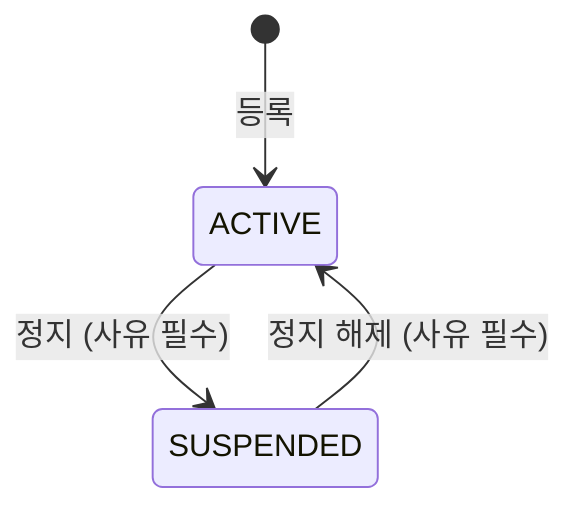

# 04-01. 기업정보관리

## 1. 개요

기업 회원이 소속된 기업의 정보를 관리한다. 승인 절차 없이 관리자가 바로 등록한다.

- 관련 테이블: `TB_COMPANY`, `TB_USER` (소속 회원 조회)

## 2. 권한

| 기능 | 액션 |
|---|---|
| 목록·상세 조회, 소속 회원 보기 | `READ` |
| 등록 | `CREATE` |
| 수정, 상태 변경 | `UPDATE` |
| 삭제 | `DELETE` |
| 엑셀 다운로드 | `EXCEL` |

## 3. 기능 목록

| ID | 기능 | 설명 |
|---|---|---|
| COM-01 | 기업 목록 조회 | 검색 조건: 기업명, 사업자등록번호, 대표자명, 상태, 등록기간 |
| COM-02 | 기업 상세 조회 | 기업 정보와 소속 회원 수 표시 |
| COM-03 | 기업 등록 | 기업 정보 입력 후 저장. 상태는 "정상"으로 시작 |
| COM-04 | 기업 수정 | 기업 정보 수정 |
| COM-05 | 기업 상태 변경 | 정상 ↔ 정지 |
| COM-06 | 기업 삭제 | 소속 회원이 없을 때만 삭제 |
| COM-07 | 소속 회원 목록 | 기업 상세에서 소속 회원 목록을 보여 준다. 회원을 누르면 사용자관리 상세로 이동 |
| COM-08 | 엑셀 다운로드 | 검색 결과 다운로드 |

## 4. 비즈니스 규칙

| ID | 규칙 |
|---|---|
| BR-01 | 사업자등록번호는 숫자 10자리이며 중복될 수 없다. 삭제된 기업의 번호도 중복으로 본다 |
| BR-02 | 사업자등록번호는 등록 후 수정할 수 없다. 잘못 등록했으면 삭제 후 다시 등록한다 |
| BR-03 | 소속 회원(탈퇴 회원 포함)이 한 명이라도 있으면 삭제할 수 없다 |
| BR-04 | 삭제는 삭제 표시(`DEL_YN = 'Y'`)로 처리한다 |
| BR-05 | 기업을 "정지"로 바꿔도 소속 회원의 상태는 바뀌지 않는다. 정지된 기업의 회원이 사용자 서비스를 쓸 수 있는지는 사용자 서비스에서 정한다 |
| BR-06 | 상태 변경 시 사유를 입력해야 한다 |

## 5. 상태 전이

## 6. 감사로그

| 작업 | 기록 내용 |
|---|---|
| 등록, 수정, 삭제 | 변경 전·후 데이터 |
| 상태 변경 | 변경 전·후 상태, 사유 |
| 엑셀 다운로드 | 검색 조건, 건수 |

## 7. 미결 사항

| No | 내용 | 제안 |
|---|---|---|
| 1 | 사업자등록번호 유효성 검사(체크섬)를 할지 | 형식(숫자 10자리)만 검사 |
| 2 | 기업 상태 변경 사유를 이력 테이블로 남길지 | 감사로그로 충분. 별도 이력 테이블 없음 |
