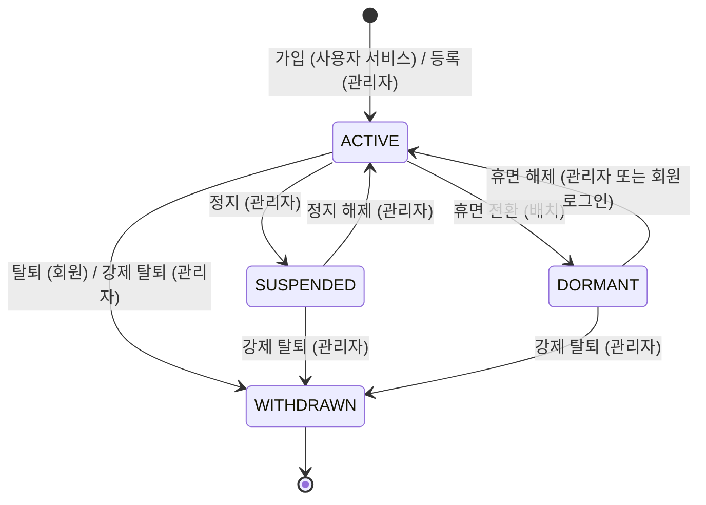

# 04-02. 사용자관리

## 1. 개요

개인 회원과 기업 회원을 등록·조회·수정·삭제하고, 상태를 관리한다.

- 회원은 사용자 서비스에서 가입하거나, 관리자가 직접 등록한다.
- 개발·테스트용 회원 데이터는 [03-initial-data.md](../03-initial-data.md)를 따른다.
- 관련 테이블: `TB_USER`, `TB_USER_STATUS_HIST`, `TB_COMPANY`, `TB_MASKING_POLICY`

## 2. 권한

| 기능 | 액션 |
|---|---|
| 목록·상세 조회, 상태 변경 이력 보기 | `READ` |
| 회원 등록 | `CREATE` |
| 정보 수정, 상태 변경, 비밀번호 초기화 | `UPDATE` |
| 회원 삭제 | `DELETE` |
| 엑셀 다운로드 | `EXCEL` |
| 개인정보 원문 보기 | `PRIVACY` |

## 3. 기능 목록

| ID | 기능 | 설명 |
|---|---|---|
| USR-01 | 회원 목록 조회 | 검색 조건: 회원 구분, 로그인 아이디, 이름, 이메일, 휴대폰 번호, 소속 기업, 상태, 가입 경로, 가입기간 |
| USR-02 | 회원 상세 조회 | 회원 정보(마스킹 설정에 따라 표시), 소속 기업, 상태, 가입 경로, 최근 로그인 일시 |
| USR-03 | 개인정보 원문 보기 | 사유 입력 후 원문 표시 ([README](README.md) 3.5) |
| USR-04 | 회원 등록 | 회원 구분, 로그인 아이디, 개인정보, 소속 기업(기업 회원) 입력. 임시 비밀번호 발급 |
| USR-05 | 회원 정보 수정 | 이름, 이메일, 휴대폰 번호, 생년월일, 부서명, 직위 수정 |
| USR-06 | 소속 기업 변경 | 기업 회원의 소속 기업 변경 |
| USR-07 | 회원 상태 변경 | 정지, 정지 해제, 휴면 해제, 강제 탈퇴 (사유 필수) |
| USR-08 | 비밀번호 초기화 | 임시 비밀번호 발급. 회원은 사용자 서비스 로그인 시 비밀번호를 바꿔야 한다 |
| USR-09 | 회원 삭제 | 삭제 표시. 사유 필수 |
| USR-10 | 상태 변경 이력 조회 | 회원 상세에서 상태 변경 이력 표시 |
| USR-11 | 엑셀 다운로드 | 검색 결과 다운로드 (마스킹 설정에 따름) |

## 4. 비즈니스 규칙

| ID | 규칙 |
|---|---|
| BR-01 | 로그인 아이디는 중복될 수 없고, 등록 후 바꿀 수 없다. 삭제된 회원의 아이디도 다시 쓸 수 없다 |
| BR-02 | 비밀번호는 관리자가 볼 수 없다. 등록·초기화 때 임시 비밀번호를 화면에 한 번만 보여 준다 |
| BR-03 | 회원 구분(개인 ↔ 기업)은 바꿀 수 없다 |
| BR-04 | 기업 회원은 소속 기업이 반드시 있어야 한다. 소속 기업은 "정상" 상태인 기업 중에서만 고를 수 있다 |
| BR-05 | 회원 등록은 `CREATE`와 `PRIVACY`, 정보 수정은 `UPDATE`와 `PRIVACY` 권한이 모두 있어야 한다. 입력 화면에서는 개인정보를 원문으로 다루기 때문이다 |
| BR-06 | 관리자가 등록한 회원은 상태 "정상"으로 시작하고, 가입 일시는 등록 일시로 한다 |
| BR-07 | 상태 변경 시 사유를 반드시 입력하고, `TB_USER_STATUS_HIST`에 이력을 남긴다 |
| BR-08 | "탈퇴" 상태가 된 회원은 다른 상태로 바꿀 수 없고, 정보도 수정할 수 없다. 삭제는 할 수 있다 |
| BR-09 | 휴면 전환은 관리자가 하지 않는다. 1년 동안 로그인하지 않은 정상 회원을 매일 배치로 휴면 전환한다 ([07-nonfunctional.md](../07-nonfunctional.md) NF-PI-21) |
| BR-10 | 삭제는 삭제 표시(`DEL_YN = 'Y'`)로 처리한다. 삭제된 회원은 목록에 나오지 않고, 사용자 서비스에 로그인할 수 없다. 작성한 게시글·댓글은 남는다 |
| BR-11 | 탈퇴(회원 의사 또는 강제)와 삭제는 다르다. 탈퇴는 상태 변경이고 회원 정보를 계속 조회할 수 있다. 삭제는 잘못 등록했거나 정리할 데이터를 목록에서 없애는 것이다 |
| BR-12 | 이메일은 형식을 검사한다. 휴대폰 번호는 숫자만 저장하고 화면에서 `-`를 넣어 보여 준다 |

## 5. 상태 전이

삭제(`DEL_YN`)는 상태와 별개다. 어느 상태에서든 삭제할 수 있다.

## 6. 감사로그

| 작업 | 기록 내용 |
|---|---|
| 등록 | 등록 데이터 (비밀번호 제외) |
| 개인정보 원문 보기 | 대상 회원, 사유 |
| 정보 수정, 소속 기업 변경 | 변경 전·후 데이터 (개인정보는 마스킹한 값) |
| 상태 변경 | 변경 전·후 상태, 사유 |
| 비밀번호 초기화 | 대상 회원 (비밀번호 값은 남기지 않음) |
| 삭제 | 대상 회원, 사유 |
| 엑셀 다운로드 | 검색 조건, 건수, 마스킹 여부 |

## 7. 미결 사항

없음. (탈퇴·삭제 회원의 개인정보는 기간 제한 없이 보관한다. [07-nonfunctional.md](../07-nonfunctional.md) NF-PI-22)
