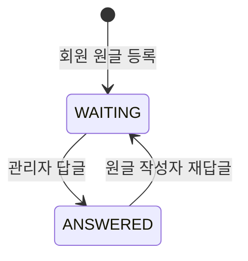

# 04-05. 통합게시판관리

## 1. 개요

게시판을 설정으로 만들고(게시판 관리), 각 게시판의 글을 운영한다(게시글 관리).
게시판은 사용자 서비스에도 노출되어 회원이 글을 쓴다.

- 관련 테이블: `TB_BOARD_MASTER`, `TB_POST`, `TB_COMMENT`, `TB_ATTACHMENT`, `TB_MENU`
- 메뉴는 아래처럼 구성한다.

| 메뉴 | 메뉴 코드 | 내용 |
|---|---|---|
| 게시판 관리 | `BOARD` | 게시판 생성, 옵션 설정 |
| 통합 게시글 관리 | `POST` | 게시판을 골라 모든 게시판의 글, 답글, 댓글, 첨부 관리 |
| 게시판별 게시글 관리 | `POST_{게시판 코드}` | 한 게시판의 글만 관리. 게시판마다 하나씩 자동 생성 (예: `POST_NOTICE` 공지사항 관리) |

> 게시판 설정은 시스템 관리자가, 게시글 운영은 콘텐츠 운영자가 맡도록 권한을 나누기 위해 메뉴를 분리했다.
> 게시판별 메뉴를 두면 "공지사항만 관리하는 운영자"처럼 게시판 단위로 권한을 줄 수 있다.

### 게시판별 관리 메뉴

```
게시판관리 (폴더)
 ├─ 게시판 관리          BOARD
 ├─ 통합 게시글 관리     POST
 └─ 게시판별 게시글 (폴더)
     ├─ 공지사항 관리    POST_NOTICE
     ├─ FAQ 관리         POST_FAQ
     └─ QnA 관리         POST_QNA
```

- 게시판을 등록할 때 "게시판별 관리 메뉴 생성"을 선택하면(기본 선택) 위 폴더 아래에 화면 메뉴를 자동으로 만든다.
- 자동 생성 메뉴의 사용 액션은 `READ`, `CREATE`, `UPDATE`, `DELETE`이며, 권한도 함께 생긴다 ([03-menu.md](03-menu.md) BR-06).
- 게시판별 메뉴의 화면과 기능은 통합 게시글 관리와 같다. 게시판이 미리 정해져 있고 다른 게시판을 고를 수 없다는 점만 다르다.

## 2. 권한

| 메뉴 | 기능 | 액션 |
|---|---|---|
| `BOARD` | 게시판 목록·상세 조회 | `READ` |
| | 게시판 등록 | `CREATE` |
| | 게시판 수정 | `UPDATE` |
| | 게시판 삭제 | `DELETE` |
| `POST`, `POST_{게시판 코드}` | 게시글·답글·댓글 조회 | `READ` |
| | 관리자 글·답글·댓글 작성 | `CREATE` |
| | 게시글 수정, 게시 여부 변경, 상단 고정 | `UPDATE` |
| | 게시글·댓글 삭제 | `DELETE` |

게시글 기능의 권한은 **통합 메뉴(`POST`) 권한 또는 해당 게시판 메뉴(`POST_{게시판 코드}`) 권한 중 하나**가 있으면 통과한다.
예: `POST_NOTICE`의 `UPDATE`만 가진 관리자는 공지사항 글만 수정할 수 있다.

## 3. 기능 목록

### 3.1 게시판 관리

| ID | 기능 | 설명 |
|---|---|---|
| BRD-01 | 게시판 목록 조회 | 검색 조건: 게시판명, 유형, 사용 여부 |
| BRD-02 | 게시판 상세 조회 | 설정 내용과 게시글 수 표시 |
| BRD-03 | 게시판 등록 | 유형을 고르면 옵션 기본값이 채워지고, 필요하면 바꾼다. 게시판별 관리 메뉴 생성 여부 선택 |
| BRD-04 | 게시판 수정 | 게시판명, 분류 그룹, 옵션, 사용 여부 수정 |
| BRD-05 | 게시판 삭제 | 삭제 표시. 게시글이 있어도 삭제 가능 (확인 메시지에 게시글 수 표시) |
| BRD-06 | 게시판별 관리 메뉴 생성·삭제 | 등록 후에도 게시판 상세에서 관리 메뉴를 만들거나 지울 수 있다 |

### 3.2 게시글 관리

| ID | 기능 | 설명 |
|---|---|---|
| PST-01 | 게시글 목록 조회 | 게시판을 고른 뒤 조회. 검색 조건: 분류, 제목, 내용, 작성자 구분, 작성자, 게시 여부, 답변 상태, 등록기간 |
| PST-02 | 게시글 상세 조회 | 원글, 답글 트리, 첨부, 댓글 표시. 비밀글도 볼 수 있다 |
| PST-03 | 관리자 글 작성 | 관리자 이름으로 글 작성 (공지 등) |
| PST-04 | 게시글 수정 | 관리자 글과 회원 글 수정. 회원 글은 사유 필수 |
| PST-05 | 게시 여부 변경 | 글을 사용자 서비스에서 숨기거나 다시 보이게 한다 |
| PST-06 | 상단 고정 | 글을 목록 맨 위에 고정하거나 해제 |
| PST-07 | 게시글 삭제 | 삭제 표시 |
| PST-08 | 답글 작성 | 답글 사용 게시판에서 원글 또는 답글 아래에 답글 작성 |
| PST-09 | 댓글 작성 | 댓글 사용 게시판에서 관리자 댓글 작성 |
| PST-10 | 댓글 삭제 | 삭제 표시 |
| PST-11 | 첨부파일 다운로드 | 게시글 첨부파일 다운로드 |
| PST-12 | 본문 이미지 넣기 | 에디터에서 이미지를 고르면 서버에 올리고 본문에 표시 |

## 4. 게시판 유형별 기본값

게시판 등록 시 유형에 따라 아래 기본값을 채운다. 등록 후 옵션은 바꿀 수 있다.

| 유형 | 회원 글쓰기 | 댓글 | 첨부 | 비밀글 | 답글 | 분류 |
|---|---|---|---|---|---|---|
| 공지 `NOTICE` | N | N | Y | N | N | 선택 |
| FAQ `FAQ` | N | N | N | N | N | 사용 권장 |
| QnA `QNA` | Y | N | Y | Y | Y | 선택 |
| 1:1문의 `INQUIRY` | Y | N | Y | Y(항상) | Y | 선택 |
| 일반 `GENERAL` | Y | Y | Y | N | N | 선택 |

## 5. 비즈니스 규칙

### 5.1 게시판

| ID | 규칙 |
|---|---|
| BR-01 | 게시판 코드는 영문 대문자, 숫자, `_`만 쓰고 중복될 수 없다. 사용자 서비스가 쓰므로 등록 후 바꿀 수 없다 |
| BR-02 | 게시판 유형은 등록 후 바꿀 수 없다 |
| BR-03 | 1:1문의 게시판은 모든 글이 비밀글이다. 작성자 본인과 관리자만 볼 수 있다 |
| BR-04 | 첨부를 허용하면 최대 개수(기본 5개)와 파일당 최대 크기(기본 10MB)를 정한다. 허용 확장자는 [07-nonfunctional.md](../07-nonfunctional.md) NF-FL-01을 따른다 |
| BR-05 | 게시판을 삭제하거나 사용 안 함으로 바꾸면 사용자 서비스에서 게시판과 글이 모두 보이지 않는다 |
| BR-06 | 옵션을 끄면 이후 새 글에만 적용된다. 예: 댓글을 끄면 새 댓글은 못 달지만 기존 댓글은 보인다 |
| BR-07 | 게시판별 관리 메뉴의 메뉴 코드는 `POST_` + 게시판 코드, 메뉴명은 게시판명 + " 관리"로 자동으로 정한다. 게시판명을 바꾸면 메뉴명도 함께 바뀐다 |
| BR-08 | 게시판을 삭제하면 게시판별 관리 메뉴와 그 권한, 역할 매핑도 함께 삭제한다. 게시판을 사용 안 함으로 바꾸면 메뉴도 사용 안 함이 된다 |
| BR-09 | 게시판별 관리 메뉴는 메뉴관리에서 직접 삭제하거나 메뉴 코드를 바꿀 수 없다. 게시판 관리에서만 만들고 지운다 |
| BR-10 | 본문에 이미지를 넣을 수 있다. 본문 이미지는 첨부파일과 별개이며, 게시판의 첨부 허용 여부·개수 제한과 상관없이 쓸 수 있다 ([07-nonfunctional.md](../07-nonfunctional.md) NF-FL-11~14) |

### 5.2 게시글

| ID | 규칙 |
|---|---|
| BR-11 | 관리자는 관리자 글과 회원 글을 모두 수정할 수 있다 |
| BR-12 | 관리자는 회원 글쓰기를 허용하지 않는 게시판에도 글을 쓸 수 있다 |
| BR-13 | 상단 고정은 원글에만 할 수 있다 |
| BR-14 | 회원 글을 수정, 숨김, 삭제할 때는 사유를 입력한다 |
| BR-15 | 관리자가 회원 글을 수정해도 작성자는 회원 그대로 둔다. 수정자(`MOD_ID`)에는 관리자를 남기고, 사용자 서비스에는 "관리자에 의해 수정됨"을 표시한다 (표시는 사용자 서비스에서 구현) |

### 5.3 답글

| ID | 규칙 |
|---|---|
| BR-21 | 답글은 답글 사용 게시판에서만 달 수 있다 |
| BR-22 | 답글은 원글 작성자와 관리자만 달 수 있다 (사용자 서비스에서도 같은 규칙) |
| BR-23 | 답글 깊이는 제한하지 않는다 |
| BR-24 | 관리자가 답글을 달면 원글의 답변 상태가 "답변완료"가 된다. 그 뒤 원글 작성자가 답글을 달면 "답변대기"로 돌아간다 |
| BR-25 | 답글이 달린 글을 삭제하면 "삭제된 글입니다"로 표시하고 답글은 유지한다. 답글이 없는 글은 목록에서 사라진다 |
| BR-26 | 원글을 숨기면 그 아래 답글도 함께 숨겨진다 |

### 5.4 댓글

| ID | 규칙 |
|---|---|
| BR-31 | 댓글은 댓글 사용 게시판에서만 달 수 있다 |
| BR-32 | 대댓글은 1단계까지만 허용한다 |
| BR-33 | 관리자는 모든 댓글을 삭제할 수 있다. 회원 댓글은 수정할 수 없다 |

## 6. 답변 상태 전이

답글 사용 게시판의 원글에만 적용한다.



관리자가 쓴 원글에는 답변 상태를 두지 않는다.

## 7. 감사로그

| 작업 | 기록 내용 |
|---|---|
| 게시판 등록, 수정, 삭제 | 변경 전·후 데이터 |
| 게시판별 관리 메뉴 생성·삭제 | 게시판, 메뉴 코드 |
| 회원 글 수정 | 변경 전·후 제목·내용, 사유 |
| 회원 글 숨김, 삭제 | 대상 글, 사유 |
| 회원 댓글 삭제 | 대상 댓글, 사유 |

관리자 본인 글의 작성·수정·삭제는 게시글 테이블의 등록자·수정자로 확인하므로 감사로그를 남기지 않는다.

## 8. 미결 사항

| No | 내용 | 제안 |
|---|---|---|
| 1 | 1:1문의를 다른 회원에게 노출하지 않는 것 외에 별도 기능(담당자 지정 등)이 필요한지 | 이번 범위에서 제외 |
