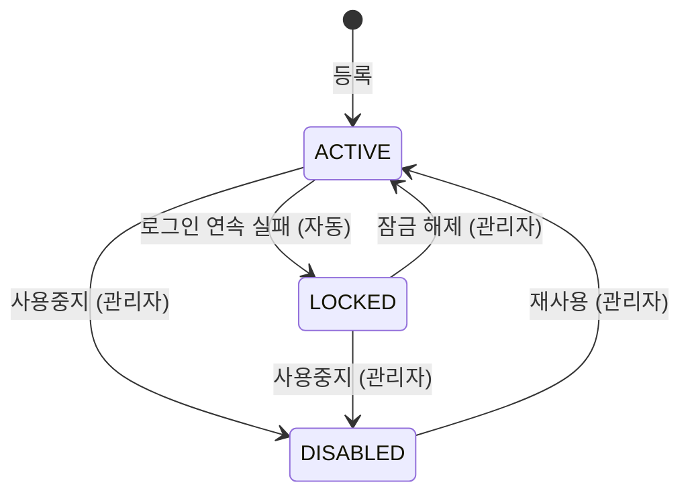

# 04-06. 관리자관리

## 1. 개요

관리자 계정을 만들고, 역할을 부여하고, 잠금·사용중지를 관리한다.

- 관련 테이블: `TB_ADMIN`, `TB_ADMIN_ROLE`, `TB_ROLE`, `TB_ADMIN_LOGIN_HIST`
- 보호 규칙은 [02-access-model.md](../02-access-model.md) 5절을 따른다.

## 2. 권한

| 기능 | 액션 |
|---|---|
| 목록·상세 조회, 로그인 이력 보기 | `READ` |
| 관리자 등록 | `CREATE` |
| 정보 수정, 역할 부여, 상태 변경, 비밀번호 초기화 | `UPDATE` |
| 사용중지 | `DELETE` |

## 3. 기능 목록

| ID | 기능 | 설명 |
|---|---|---|
| ADM-01 | 관리자 목록 조회 | 검색 조건: 로그인 아이디, 이름, 부서, 역할, 상태 |
| ADM-02 | 관리자 상세 조회 | 기본 정보, 부여된 역할, 마지막 로그인 일시 |
| ADM-03 | 관리자 등록 | 기본 정보와 역할 입력. 임시 비밀번호 발급 |
| ADM-04 | 관리자 정보 수정 | 이름, 이메일, 휴대폰 번호, 부서 수정 |
| ADM-05 | 역할 부여·회수 | 관리자 상세에서 역할을 추가하거나 뺀다 |
| ADM-06 | 잠금 해제 | 로그인 실패로 잠긴 계정 해제. 실패 횟수 초기화 |
| ADM-07 | 비밀번호 초기화 | 임시 비밀번호 발급 |
| ADM-08 | 사용중지 / 재사용 | 계정을 쓰지 못하게 하거나 다시 쓰게 한다 |
| ADM-09 | 로그인 이력 조회 | 관리자 상세에서 최근 로그인 시도 이력 표시 |

## 4. 비즈니스 규칙

| ID | 규칙 |
|---|---|
| BR-01 | 로그인 아이디는 중복될 수 없고, 등록 후 바꿀 수 없다. 사용중지된 관리자의 아이디도 다시 쓸 수 없다 |
| BR-02 | 등록·비밀번호 초기화 시 임시 비밀번호를 만들어 화면에 한 번만 보여 준다. 다시 볼 수 없다. 메일·문자 발송은 하지 않는다 |
| BR-03 | 임시 비밀번호로 로그인하면 비밀번호를 바꿔야 다른 화면을 쓸 수 있다 ([09-auth.md](09-auth.md)) |
| BR-04 | 관리자는 역할이 하나 이상 있어야 한다 |
| BR-05 | 본인 계정의 역할은 바꿀 수 없다 (R4). 본인 계정을 사용중지할 수도 없다 |
| BR-06 | 본인이 가진 권한을 넘는 역할은 부여할 수 없다 (R5). 슈퍼관리자는 예외 |
| BR-07 | 사용 중인 슈퍼관리자가 1명뿐이면 그 관리자의 사용중지, 슈퍼관리자 역할 회수를 할 수 없다 (R3) |
| BR-08 | 관리자는 삭제하지 않는다. 사용중지로 처리한다 |
| BR-09 | 사용중지하거나 비밀번호를 초기화하면 그 관리자의 현재 로그인(세션과 Refresh Token 모두)을 끊는다 |
| BR-10 | 비밀번호는 관리자가 볼 수 없다. 해시로만 저장한다 |

## 5. 상태 전이

## 6. 감사로그

| 작업 | 기록 내용 |
|---|---|
| 등록, 정보 수정 | 변경 전·후 데이터 (비밀번호 제외) |
| 역할 부여·회수 | 추가·제거된 역할 |
| 잠금 해제, 사용중지, 재사용 | 변경 전·후 상태 |
| 비밀번호 초기화 | 대상 관리자 (비밀번호 값은 남기지 않음) |

## 7. 미결 사항

없음.
