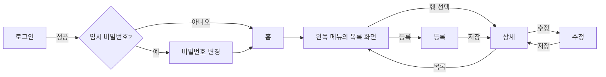

# 05. IA · 화면 명세

관리자 화면의 정보 구조(메뉴 트리), 공통 레이아웃, 공통 컴포넌트, 화면 목록을 정의한다.
화면별 상세(검색 조건, 목록 칼럼, 입력 항목, 버튼)는 [05-screens/](05-screens/) 아래 모듈별 문서에 있다.

이 명세는 프론트 3종(React / JSP + API / JSP SSR)이 **똑같이** 구현한다. 프론트별로 달라지는 부분은 7절에 모았다.

## 1. 메뉴 트리 (= 메뉴관리 초기 데이터)

| 1단계 | 2단계 | 3단계 | 메뉴 코드 | 종류 | URL | 사용 액션 | 시스템 |
|---|---|---|---|---|---|---|---|
| 회원관리 | | | `MEMBER_ROOT` | 폴더 | | | |
| | 기업정보관리 | | `COMPANY` | 화면 | `/companies` | R C U D E | |
| | 사용자관리 | | `USER` | 화면 | `/users` | R C U D E P | |
| 게시판관리 | | | `BOARD_ROOT` | 폴더 | | | |
| | 게시판 관리 | | `BOARD` | 화면 | `/boards` | R C U D | |
| | 통합 게시글 관리 | | `POST` | 화면 | `/posts` | R C U D | |
| | 게시판별 게시글 | | `POST_BY_BOARD` | 폴더 | | | Y |
| | | 공지사항 관리 (자동) | `POST_NOTICE` | 화면 | `/posts/NOTICE` | R C U D | |
| 시스템관리 | | | `SYSTEM_ROOT` | 폴더 | | | Y |
| | 코드관리 | | `CODE` | 화면 | `/codes` | R C U D | |
| | 메뉴관리 | | `MENU` | 화면 | `/menus` | R C U D | Y |
| | 마스킹 설정 | | `MASKING` | 화면 | `/masking` | R U | Y |
| | 감사로그 | | `AUDIT_LOG` | 화면 | `/audit-logs` | R E | Y |
| 관리자관리 | | | `ADMIN_ROOT` | 폴더 | | | Y |
| | 관리자 | | `ADMIN` | 화면 | `/admins` | R C U D | Y |
| | 역할 | | `ROLE` | 화면 | `/roles` | R C U D | Y |
| | 권한 | | `PERMISSION` | 화면 | `/permissions` | R U | Y |

- 액션 약어: R `READ`, C `CREATE`, U `UPDATE`, D `DELETE`, E `EXCEL`, P `PRIVACY`
- "게시판별 게시글" 아래 메뉴는 게시판을 만들 때 자동으로 생긴다 ([04-features/05-board.md](04-features/05-board.md)). 표의 공지사항 관리는 예시다.
- 감사로그 메뉴는 이 단계에서 추가했다 ([04-features/11-log.md](04-features/11-log.md)).
- 메뉴가 아닌 화면: 로그인, 비밀번호 변경, 홈, 내 정보, 권한 없음, 오류

## 2. 화면 URL 규칙

화면 URL은 프론트 3종이 같게 쓰고, 실제 주소에는 프론트 접두어(`/react`, `/jsp`, `/ssr`)를 앞에 붙인다 ([08-architecture.md](08-architecture.md) 1.1). API URL(`/api/...`)은 06 API 명세에서 정한다.

| 화면 | URL | 예 |
|---|---|---|
| 목록 | `/{자원}` | `/companies` |
| 등록 | `/{자원}/new` | `/companies/new` |
| 상세 | `/{자원}/{id}` | `/companies/12` |
| 수정 | `/{자원}/{id}/edit` | `/companies/12/edit` |

- 검색 조건과 페이지는 쿼리스트링으로 URL에 남긴다 (예: `/users?status=ACTIVE&page=2`). 새로고침·뒤로가기 후에도 검색 상태가 유지되어야 한다.
- 메뉴 트리·코드처럼 한 화면에서 목록과 상세를 같이 보는 화면은 목록 URL 하나만 쓴다.

## 3. 공통 레이아웃

```
┌──────────────────────────────────────────────────────────────┐
│ [로고] 관리자 서비스                    홍길동(시스템관리자) ▾ │  ← 헤더
├────────────┬─────────────────────────────────────────────────┤
│ 회원관리   │ 홈 > 회원관리 > 사용자관리                       │  ← 경로
│  기업정보  │ 사용자관리                                       │  ← 화면 제목
│  사용자 ●  │ ┌─────────────────────────────────────────────┐ │
│ 게시판관리 │ │ 검색 영역                                   │ │
│  ...       │ └─────────────────────────────────────────────┘ │
│ 시스템관리 │ 총 125건          [엑셀] [등록]   20개씩 보기 ▾ │  ← 목록 상단
│  ...       │ ┌─────────────────────────────────────────────┐ │
│            │ │ 목록 테이블                                 │ │
│            │ └─────────────────────────────────────────────┘ │
│            │            « ‹ 1 2 3 4 5 › »                    │  ← 페이징
└────────────┴─────────────────────────────────────────────────┘
   ↑ 왼쪽 메뉴 (내 권한으로 보이는 메뉴만)
```

| 영역 | 내용 |
|---|---|
| 헤더 | 서비스명(누르면 홈), 내 이름과 대표 역할. 이름을 누르면 "내 정보", "비밀번호 변경", "로그아웃" |
| 왼쪽 메뉴 | 내 메뉴 트리 ([02-access-model.md](02-access-model.md) 3.2 노출 규칙). 현재 메뉴 강조, 폴더는 접고 펼 수 있다 |
| 경로 | 홈 > 1단계 > 2단계 (> 3단계) |
| 본문 | 화면 제목과 내용 |

- 화면 최소 폭은 1280px로 한다. 모바일 대응은 하지 않는다.

## 4. 공통 컴포넌트

프론트 3종이 같은 모양·동작으로 만든다.

| ID | 컴포넌트 | 설명 |
|---|---|---|
| CMP-01 | 검색 영역 | 조건 입력 칸 + [검색] [초기화]. Enter로 검색. 검색하면 1페이지로 이동 |
| CMP-02 | 목록 테이블 | 칼럼 머리글, 행을 누르면 상세로 이동. 결과가 없으면 "조회된 데이터가 없습니다" |
| CMP-03 | 페이징 | « ‹ 번호(최대 10개) › » + 페이지 크기 선택(10/20/50) + 총 건수 |
| CMP-04 | 코드 콤보 | 그룹코드를 받아 상세코드 목록을 보여 주는 선택 상자. 검색용은 맨 위에 "전체" |
| CMP-05 | 기간 선택 | 시작일 ~ 종료일. 빠른 선택(오늘, 1주일, 1개월, 3개월) |
| CMP-06 | 확인창 | 삭제·상태 변경 등 되돌리기 어려운 작업 전에 [확인] [취소] |
| CMP-07 | 사유 입력창 | 사유 입력(필수)이 있는 확인창. 상태 변경, 회원 글 수정·숨김·삭제 등에 쓴다 |
| CMP-08 | 개인정보 원문 보기창 | 사유 코드(`PRIVACY_REASON`) 선택 + 기타일 때 직접 입력 → 원문 표시 |
| CMP-09 | 임시 비밀번호 표시창 | 발급된 임시 비밀번호를 상세 화면 위쪽 안내 상자에 한 번만 보여 주고 [복사] [닫기] 버튼 제공. 닫거나 화면을 옮기면 다시 볼 수 없다는 안내. ③ SSR도 같게 하려고 팝업 대신 상자로 보여 준다 |
| CMP-10 | 알림 메시지 | 저장·삭제 성공 등 짧은 메시지를 화면 위쪽에 3초간 표시 |
| CMP-11 | 입력 오류 표시 | 오류가 난 입력 칸 아래에 빨간 글씨로 메시지. 첫 오류 칸으로 이동 |
| CMP-12 | 관리자·회원 선택창 | 이름·아이디로 검색해 고르는 화면 안 검색 카드 (권한관리의 관리자별 권한 조회 등). ③ SSR은 API(토큰)를 쓰지 않으므로 팝업 대신 같은 화면에서 검색 결과(10건)를 보여 준다 |
| CMP-13 | 트리 | 메뉴 트리, 권한 표에 쓴다. 펼치기·접기 |
| CMP-14 | 파일 첨부 | 여러 파일 선택, 개수·크기 제한 안내, 첨부된 파일 목록과 삭제 |
| CMP-15 | 에디터 | 게시글 본문 입력 (Quill). 기본 서식(굵게, 기울임, 밑줄, 목록, 링크, 이미지)만 지원. 이미지는 서버에 올린 뒤 본문에 표시 |
| CMP-16 | 우편번호 검색 | 카카오 우편번호 서비스 팝업. 고르면 우편번호·주소 칸을 채운다 |

### 4.1 공통 표시 형식

| 항목 | 형식 |
|---|---|
| 일시 | `2026-10-04 14:30` (초는 상세 화면에서만 `2026-10-04 14:30:15`) |
| 날짜 | `2026-10-04` |
| 금액·건수 | 천 단위 쉼표 `1,234` |
| 휴대폰 번호 | `010-1234-5678` |
| 사업자등록번호 | `123-45-67890` |
| 여부 칼럼 | 사용 / 사용 안 함, 예 / 아니오 등 의미에 맞는 말 |
| 빈 값 | `-` |

### 4.2 버튼 노출

- 버튼마다 필요한 권한이 있다 (각 화면 문서의 "버튼" 표).
- 권한이 없으면 버튼을 **비활성**으로 보여 준다. 마우스를 올리면 "권한이 없습니다"를 표시한다.
- 상태 때문에 할 수 없는 작업(예: 탈퇴 회원 수정)은 버튼을 숨기고, 이유를 화면에 표시한다.
- 권한과 상태 조건이 둘 다 걸리면 상태 조건을 먼저 적용한다. 상태 때문에 숨겨질 버튼은 권한이 없어도 비활성으로 보이지 않는다.
- 왼쪽 메뉴는 버튼과 다르다. `READ` 권한이 없는 메뉴는 숨긴다 ([02-access-model.md](02-access-model.md) 3.2).

## 5. 화면 목록

| 화면 ID | 화면명 | 메뉴 | 유형 | 기능 ID | 상세 |
|---|---|---|---|---|---|
| SCR-AUTH-01 | 로그인 | - | 단독 | AUTH-01 | [00-common.md](05-screens/00-common.md) |
| SCR-AUTH-02 | 비밀번호 변경 | - | 단독 | AUTH-03, AUTH-06 | 〃 |
| SCR-HOME | 홈 | - | 본문 | - | 〃 |
| SCR-MY-01 | 내 정보 | - | 본문 | AUTH-05 | 〃 |
| SCR-ERR-403 | 권한 없음 | - | 본문 | - | 〃 |
| SCR-ERR-404 / 500 | 페이지 없음 / 오류 | - | 본문 | - | 〃 |
| SCR-COM-01 | 기업 목록 | COMPANY | 목록 | COM-01, 08 | [01-company.md](05-screens/01-company.md) |
| SCR-COM-02 | 기업 상세 | COMPANY | 상세 | COM-02, 05, 06, 07 | 〃 |
| SCR-COM-03 | 기업 등록·수정 | COMPANY | 입력 | COM-03, 04 | 〃 |
| SCR-USR-01 | 회원 목록 | USER | 목록 | USR-01, 11 | [02-user.md](05-screens/02-user.md) |
| SCR-USR-02 | 회원 상세 | USER | 상세 | USR-02, 03, 06~10 | 〃 |
| SCR-USR-03 | 회원 등록·수정 | USER | 입력 | USR-04, 05 | 〃 |
| SCR-MNU-01 | 메뉴관리 | MENU | 트리 + 상세 | MNU-01~07 | [03-menu.md](05-screens/03-menu.md) |
| SCR-COD-01 | 코드관리 | CODE | 목록 + 목록 | COD-01~08 | [04-code.md](05-screens/04-code.md) |
| SCR-BRD-01 | 게시판 목록 | BOARD | 목록 | BRD-01 | [05-board.md](05-screens/05-board.md) |
| SCR-BRD-02 | 게시판 상세 | BOARD | 상세 | BRD-02, 05, 06 | 〃 |
| SCR-BRD-03 | 게시판 등록·수정 | BOARD | 입력 | BRD-03, 04 | 〃 |
| SCR-PST-01 | 게시글 목록 | POST, POST_* | 목록 | PST-01 | 〃 |
| SCR-PST-02 | 게시글 상세 | POST, POST_* | 상세 | PST-02, 05~11 | 〃 |
| SCR-PST-03 | 게시글 작성·수정 | POST, POST_* | 입력 | PST-03, 04, 08 | 〃 |
| SCR-ADM-01 | 관리자 목록 | ADMIN | 목록 | ADM-01 | [06-admin.md](05-screens/06-admin.md) |
| SCR-ADM-02 | 관리자 상세 | ADMIN | 상세 | ADM-02, 05~09 | 〃 |
| SCR-ADM-03 | 관리자 등록·수정 | ADMIN | 입력 | ADM-03, 04 | 〃 |
| SCR-PRM-01 | 권한관리 | PERMISSION | 트리 + 표 | PRM-01~03 | [07-permission.md](05-screens/07-permission.md) |
| SCR-PRM-02 | 관리자별 최종 권한 | PERMISSION | 표 | PRM-04 | 〃 |
| SCR-ROL-01 | 역할 목록 | ROLE | 목록 | ROL-01 | [08-role.md](05-screens/08-role.md) |
| SCR-ROL-02 | 역할 상세 | ROLE | 상세 | ROL-02, 04, 06, 07 | 〃 |
| SCR-ROL-03 | 역할 등록·수정 | ROLE | 입력 | ROL-03, 05 | 〃 |
| SCR-MSK-01 | 마스킹 설정 | MASKING | 표 | MSK-01, 02 | [10-masking.md](05-screens/10-masking.md) |
| SCR-LOG-01 | 감사로그 | AUDIT_LOG | 목록 | LOG-01~03 | [11-log.md](05-screens/11-log.md) |
| SCR-LOG-02 | 로그인 이력 | AUDIT_LOG | 목록 | LOG-04, 05 | 〃 |

## 6. 공통 화면 흐름



- 저장 후에는 상세 화면으로 간다. 목록으로 돌아가면 이전 검색 조건과 페이지를 유지한다.
- 등록·수정 화면에서 입력한 내용이 있는데 나가려 하면 "저장하지 않은 내용이 있습니다"라고 확인한다.

## 7. 프론트 3종 구현 차이

화면 명세는 같고, 아래 부분만 프론트별로 다르게 구현한다.

| 항목 | ① React | ② JSP + API | ③ JSP SSR |
|---|---|---|---|
| 인증 | 토큰 (JWT). Access Token 만료 시 자동 재발급 | 토큰 (JWT). 페이지를 열 때마다 재발급 후 API 호출 | 세션 |
| 화면 전환 | 클라이언트 라우팅 | 페이지 이동 (JSP 요청) | 페이지 이동 |
| 데이터 조회 | API 호출 | 페이지 로드 후 API 호출(AJAX) | 컨트롤러가 Model에 담아 렌더링 |
| 저장 | API 호출 | API 호출(AJAX) | Form 전송 → 처리 후 상세로 리다이렉트 |
| 입력 오류 표시 | API 오류 응답을 칸별로 표시 | 〃 | 서버 검증 결과를 다시 렌더링 |
| 확인창·사유 입력창 | 모달 컴포넌트 | 모달 (JavaScript) | 모달 (JavaScript) + Form 전송 |
| 개인정보 원문 보기 | API 호출 후 표시 | API 호출 후 표시 | 원문 보기 요청 → 원문을 포함해 다시 렌더링 |
| 알림 메시지 | 상태로 관리 | JavaScript | 리다이렉트 후 1회성 메시지(Flash) |
| 메뉴·버튼 노출 | 로그인 시 받은 권한 목록 | 〃 | 서버가 렌더링할 때 권한 확인 |
| 메뉴 순서 변경 (드래그·▲▼) | 컴포넌트 상태로 관리 → [순서 저장] 시 API 호출 | JavaScript로 트리 조작 → [순서 저장] 시 API 호출 | JavaScript로 트리 조작 → [순서 저장] 시 순서 목록을 Form 전송 |

## 8. 미결 사항

없음. (UI 라이브러리는 세 프론트 모두 Bootstrap 5. [08-architecture.md](08-architecture.md) 2.2)
