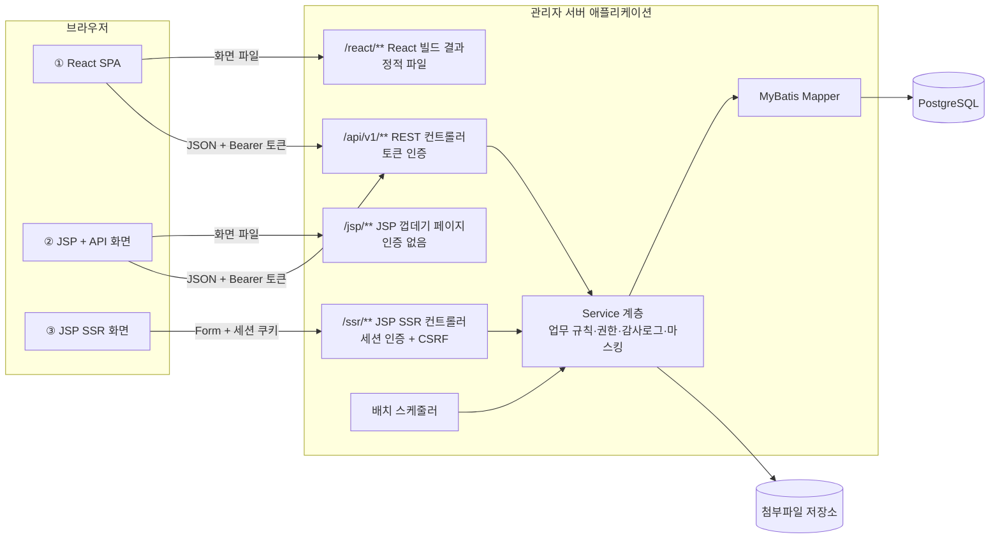
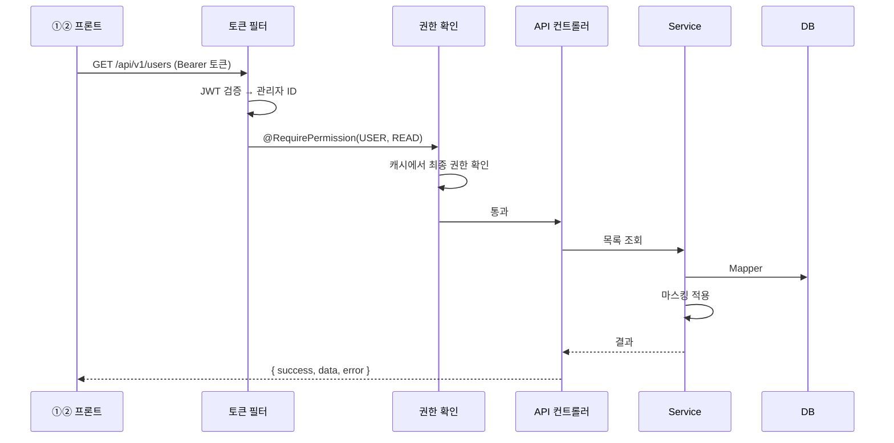
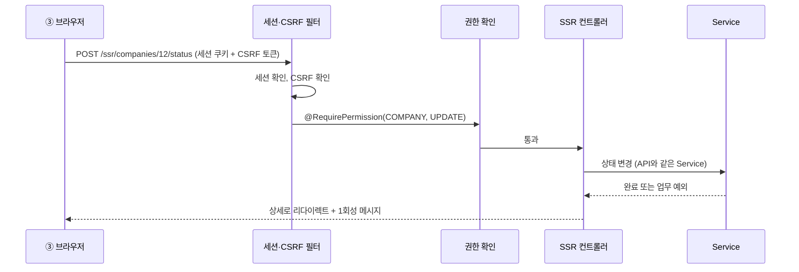

# 08. 아키텍처

서버·프론트 구성, 모듈 구조, 주요 기술 선택, 공통 처리 방식을 정한다.
이 문서는 개발을 시작할 때 프로젝트 골격을 만드는 기준이 된다.

## 1. 전체 구성

**하나의 서버 애플리케이션**이 API, 세 프론트의 화면, 배치를 모두 제공한다.



| 결정 | 이유 |
|---|---|
| 서버 앱 1개 | 권한·코드 캐시를 한곳에서 관리할 수 있고, 같은 도메인이라 CORS가 필요 없다. 학습용으로 배포가 단순하다 |
| URL 앞부분으로 프론트 구분 | `/react`, `/jsp`, `/ssr`로 나누면 한 서버에서 세 프론트를 나란히 띄워 비교할 수 있다 |
| 보안 설정을 경로별로 분리 | `/api/**`는 토큰, `/ssr/**`는 세션으로 서로 다른 보안 설정(Spring Security 필터 체인)을 쓴다 |

### 1.1 화면 URL

[05-ia-screens.md](05-ia-screens.md) 2절의 화면 URL 앞에 프론트 접두어를 붙인다. 메뉴 테이블의 `MENU_URL`에는 접두어 없는 경로(`/companies`)를 저장하고, 각 프론트가 자기 접두어를 붙여 쓴다.

| 프론트 | 예: 기업 목록 | 로그인 화면 |
|---|---|---|
| ① React | `/react/companies` | `/react/login` |
| ② JSP + API | `/jsp/companies` | `/jsp/login` |
| ③ JSP SSR | `/ssr/companies` | `/ssr/login` |
| API | `/api/v1/companies` | `/api/v1/auth/token` |

- `/`로 들어오면 세 프론트 중 하나를 고르는 안내 페이지를 보여 준다 (학습용).
- 게시글 본문 이미지는 인증 없이 `/files/images/{UUID}.{확장자}`로 제공한다 ([07-nonfunctional.md](07-nonfunctional.md) NF-FL-13).

## 2. 기술 스택

### 2.1 서버

| 구분 | 선택 | 비고 |
|---|---|---|
| 프레임워크 | 전자정부프레임워크 (Spring Boot 기반 실행환경) | 버전은 3절 |
| 언어 | Java (전자정부프레임워크 버전이 지원하는 LTS) | |
| 빌드 | Maven 멀티 모듈 | 전자정부프레임워크 기본 빌드 도구 |
| DB 접근 | MyBatis | 전자정부프레임워크 표준 |
| DB | PostgreSQL | |
| DB 변경 관리 | Flyway | `db/migration`: V1 확장, V2 테이블, V3 운영 필수 데이터, V4 Spring Session 테이블 / `db/testdata`: 개발용 테스트 데이터(`R__`, `local` 프로필만) |
| 보안 | Spring Security | 경로별 필터 체인 2개 (토큰 / 세션) |
| JWT | jjwt | Access Token 생성·검증 |
| 세션 저장 | Spring Session JDBC | 세션을 DB에 저장해 관리자별로 찾아 끊을 수 있게 함 (동시 로그인 금지, 사용중지 시 강제 로그아웃) |
| 캐시 | Spring Cache + Caffeine | 관리자별 최종 권한, 코드 목록 (서버 메모리) |
| 화면 템플릿 (②③) | JSP + JSTL | 공통 레이아웃은 JSP 태그 파일(`.tag`)로 만든다 |
| 엑셀 | Apache POI (SXSSF) | 대량 행을 메모리 적게 쓰며 생성 |
| HTML 정제 | jsoup Safelist | 게시글 본문의 허용 태그만 남김 (NF-WS-06) |
| API 명세 | `api/openapi.yaml` (명세 우선) | API 형식의 정본. 개발 환경 Swagger UI는 이 파일을 그대로 보여 줌 ([ADR-0020](adr/0020-openapi-spec-first.md)) |
| 명세 검사 | Redocly CLI (lint) | `openapi.yaml` 문법·규칙 검사 |
| 계약 테스트 | `swagger-request-validator-core` 2.46.1 + 직접 만든 MockMvc 연결(`OpenApiContract`) | 통합 테스트에서 실제 요청·응답을 `openapi.yaml`과 대조. 3.x는 Java 21 바이트코드라 쓰지 않고, 공식 MockMvc 연동 모듈은 `javax.servlet` 기준이라 쓰지 않는다. 명세에 없는 응답 필드도 오류로 잡으므로 응답 스키마는 `allOf` 없이 펼쳐 쓴다 |
| 배치 | Spring `@Scheduled` | 서버 1대 기준. 여러 대로 늘리면 중복 실행 방지가 필요 |
| 로그 | Log4j2 (`spring-boot-starter-log4j2`) | 일별 파일, 30일 보관 (07 비기능 5절). 전자정부 실행환경(`ptl-mvc`)이 Log4j2를 쓰므로 Spring Boot 기본 Logback 대신 Log4j2로 통일 |
| 테스트 | JUnit 5, Testcontainers(PostgreSQL) | Mapper·Service 테스트는 실제 PostgreSQL 컨테이너로 |

### 2.2 프론트

세 프론트의 겉모습을 맞추기 위해 **같은 UI 라이브러리(Bootstrap 5 + Tabler 관리자 테마)** 를 쓴다.

| 구분 | ① React | ② JSP + API | ③ JSP SSR |
|---|---|---|---|
| 언어 | TypeScript | JavaScript (ES2020) | JSP + JavaScript |
| 빌드 | Vite | 없음 (정적 JS 파일) | 없음 |
| UI | Bootstrap 5 + Tabler CSS (컴포넌트는 React-Bootstrap) | Bootstrap 5 + Tabler | Bootstrap 5 + Tabler |
| 우편번호 | 카카오 우편번호 서비스 | 〃 | 〃 |
| 라우팅 | React Router | 페이지 이동 | 페이지 이동 |
| API 호출 | axios + TanStack Query | `fetch` 래퍼 함수 | (API 안 씀) |
| API 타입 | `openapi.yaml`에서 생성 (`npm run gen:api` → `src/api/schema.d.ts`, 커밋함) | - | - |
| 토큰 재발급 | axios 인터셉터 | `fetch` 래퍼에서 처리 | (세션) |
| 트리 드래그 | SortableJS (react-sortablejs) | SortableJS | SortableJS |
| 에디터 | Quill (작은 래퍼 컴포넌트로 직접 연결) | Quill | Quill |
| 테스트 | Vitest | - | - |

- ②와 ③은 공통 CSS·JS(모달, 알림, 코드 콤보 등)를 같이 쓴다.
- **게시글 에디터는 Quill**을 쓴다. 순수 JavaScript라 세 프론트에서 같은 에디터를 쓸 수 있다.
  - React에서는 오래 관리되지 않은 래퍼 패키지(react-quill) 대신, Quill을 직접 생성하는 작은 컴포넌트를 만든다.
  - Quill이 만든 HTML은 저장할 때 서버에서 jsoup으로 허용 태그만 남긴다 (NF-WS-06). 허용 목록은 Quill 툴바에서 쓰는 서식(굵게, 기울임, 밑줄, 목록, 링크, 이미지) 기준으로 정한다.
  - ③ JSP SSR은 Form 전송 직전에 에디터 내용(HTML)을 숨김 입력 칸에 옮겨 담아 보낸다.
  - 본문 이미지는 Quill의 기본 동작(Base64 삽입)을 바꿔, 이미지를 고르면 업로드 API로 올리고 받은 URL을 넣도록 이미지 버튼 처리를 직접 만든다 ([06-api/05-board.md](06-api/05-board.md) API-PST-13). 첨부파일은 이와 별도로 기존 방식대로 올린다.
- **Tabler**는 Bootstrap 5 위에 만든 관리자 테마다. 레이아웃(헤더·왼쪽 메뉴), 카드, 표, 폼 모양을 Tabler 기준으로 맞춘다. React는 Tabler CSS를 불러오고 동작은 React-Bootstrap 컴포넌트로 만든다.
- **우편번호 검색**은 카카오 우편번호 서비스의 JavaScript를 세 프론트에서 같게 쓴다. 보안 헤더(CSP)에 해당 도메인을 허용한다 ([07-nonfunctional.md](07-nonfunctional.md) NF-WS-08).
- 세 프론트 공통 E2E 테스트(Playwright)를 하나의 시나리오로 만들고 접두어만 바꿔 세 번 실행한다. 화면 명세대로 똑같이 동작하는지 확인하는 용도다.

## 3. 전자정부프레임워크 버전

- 전자정부프레임워크는 **5.0.2로 고정**한다 ([ADR-0017](adr/0017-egovframe-5-0-2.md)). 버전을 올릴 때는 새 ADR로 정한다.
- 5.x는 Spring Framework 6 / Spring Boot 3 계열, Java 17 이상, Jakarta EE(`jakarta.*` 패키지) 기반이다. Spring Security도 6.x 설정 방식을 따른다.
- Java, Spring Boot 등 하위 버전은 5.0.2가 지정하는 버전을 그대로 쓴다. 프로젝트를 만들 때 5.0.2의 릴리스 노트·`pom.xml`로 확인해 아래 표에 숫자로 기록한다. 따로 올리거나 내리지 않는다.
- Spring Boot 기반 템플릿을 쓴다. JSP를 쓰므로 내장 Tomcat에 JSP 엔진(Jasper)과 Jakarta JSTL을 추가하고 `war` 패키징을 기본으로 한다.

| 항목 | 버전 |
|---|---|
| 전자정부프레임워크 | **5.0.2** |
| 상위 POM | `org.egovframe.boot:egovframe-boot-starter-parent:5.0.2` |
| Java | 17 (컴파일 `release 17`, CI JDK 17) |
| Spring Boot | 3.5.6 |
| Spring Framework | 6.2.11 |
| Spring Security | 6.5.5 |
| MyBatis / mybatis-spring | 3.5.19 / 3.0.5 (mybatis-spring-boot-starter 3.0.5) |
| PostgreSQL JDBC | 42.7.3 |
| Maven | 3.9.11 (Maven Wrapper) |
| PostgreSQL | 16 이상 |
| Node.js (React 빌드) | 22 (`.nvmrc`) |

- 위 값은 2026-10-05 프로젝트 생성 시 5.0.2 상위 POM에서 확인했다.
- 로컬 JDK가 17보다 높아도 Java 17에서 못 읽는 의존성을 잡도록 Maven Enforcer `enforceBytecodeVersion`(최대 17)을 건다.
- Testcontainers 1.21.x는 Docker 29 이상에서 기본 API 버전이 너무 낮아 실패한다. `admin-web/src/test/resources/docker-java.properties`에 `api.version=1.44`를 지정해 둔다.

## 4. 모듈 구조

```
project_1001/
├─ CLAUDE.md
├─ docs/                         기획 문서
├─ api/
│  └─ openapi.yaml               API 명세 정본 (명세 우선, ADR-0020)
├─ pom.xml                       Maven 상위 POM
├─ admin-core/                   공통 + 업무 로직 (화면·인증 방식과 무관)
│  └─ src/main/java/egovframework/admin/
│     ├─ common/                 공통: 응답 형식, 오류 코드, 예외, 페이징, 마스킹, 엑셀, 파일
│     ├─ security/               권한 확인(@RequirePermission 평가), 현재 관리자 정보
│     ├─ audit/                  감사로그 기록
│     ├─ company/                기능별 패키지: service, mapper, vo
│     ├─ user/
│     ├─ menu/  code/  board/  post/
│     ├─ admin/  role/  permission/
│     ├─ masking/  log/  auth/
│     └─ batch/                  배치 작업 (BAT-01~04)
│  └─ src/main/resources/
│     ├─ mapper/                 MyBatis XML (기능별)
│     └─ db/migration/           Flyway SQL (V1__schema.sql, V2__seed.sql, ...)
├─ admin-web/                    실행 애플리케이션 (war)
│  └─ src/main/java/egovframework/admin/web/
│     ├─ config/                 보안 필터 체인, MVC, 캐시, 스케줄러 설정
│     ├─ api/                    ①② REST 컨트롤러 (/api/v1/**)
│     ├─ ssr/                    ③ JSP SSR 컨트롤러 (/ssr/**)
│     └─ jsp/                    ② JSP 껍데기 페이지 컨트롤러 (/jsp/**)
│  └─ src/main/webapp/
│     ├─ WEB-INF/views/ssr/      ③ JSP
│     ├─ WEB-INF/views/jsp/      ② JSP
│     ├─ WEB-INF/tags/           공통 레이아웃 태그 파일
│     └─ static/common/          ②③ 공통 CSS·JS
└─ admin-react/                  ① React 프로젝트 (Vite)
   └─ src/
      ├─ api/                    API 호출 함수, axios 설정
      ├─ components/             공통 컴포넌트 (CMP-01~15)
      ├─ pages/                  화면 (기능별 폴더)
      └─ auth/                   토큰 관리, 권한 훅
```

- `admin-core`는 웹·인증 방식을 모른다. Service는 "현재 관리자"를 인터페이스로 받아 API(토큰)와 SSR(세션) 어느 쪽에서 불러도 같게 동작한다.
- React는 개발 중에는 Vite 개발 서버(API는 프록시)로 실행한다. 서버는 `app.react.location`(기본 `file:../admin-react/dist/`, 환경 변수 `REACT_DIST`)의 빌드 결과를 `/react/**`로 제공하고, 파일이 없는 화면 주소는 `index.html`로 넘긴다. war 안에 빌드 결과를 넣는 배포 방식은 배포 구성을 정할 때 추가한다.
- ②③ JSP는 Tabler를 WebJar(`org.webjars.npm:tabler__core`)로 받아 `/webjars/tabler__core/{버전}/dist/`에서 쓴다. ①은 npm `@tabler/core` 같은 버전을 쓴다.
- ②③의 공통 레이아웃은 JSP 태그 파일(`WEB-INF/tags/layout.tag`, `menu.tag`, `head.tag`)이다. ③은 서버가 메뉴를 그리고, ②는 같은 자리를 `static/common/js/admin-jsp.js`가 API로 채운다.

## 5. 요청 처리 흐름

### 5.1 ①② API 요청



### 5.2 ③ SSR 요청



## 6. 공통 처리

| 항목 | 방식 |
|---|---|
| 권한 확인 | `PermissionInterceptor`(/api/**, /ssr/**)가 컨트롤러 메서드의 표시를 본다. `@RequirePermission(menu, action)`: 메뉴 × 액션 권한, 여러 메뉴면 하나라도 있으면 통과(`menu = {"POST", "POST_{boardCd}"}`). `@LoginOnly`: 로그인만. `@PublicEndpoint`: 공개. **표시가 없으면 기본 거부**. 임시 비밀번호 상태에서는 `@AllowTempPassword`가 있는 메서드만 쓸 수 있다 ([02-access-model.md](02-access-model.md) 4절) |
| 인증 상태 확인 | 요청마다 `AdminAuthInfoService`(캐시)로 관리자 상태·임시 비밀번호·최종 권한을 확인한다. 토큰·세션에는 권한을 넣지 않는다 |
| 업무 오류 | Service가 `BusinessException(ErrorCode)`을 던진다. API는 공통 핸들러가 실패 JSON으로, SSR은 화면 메시지로 바꾼다. 오류 코드는 [06-api-spec.md](06-api-spec.md) 6절 |
| 입력 검증 | 요청 객체에 Bean Validation. 업무 규칙 검증은 Service에서. API·SSR이 같은 검증 객체를 쓴다 |
| 감사로그 | Service에서 `AuditLogService.record(...)`를 직접 호출한다 (AOP로 숨기지 않음. 무엇을 기록하는지 코드에서 바로 보이게). 원래 작업과 같은 트랜잭션 |
| 마스킹 | Service가 응답 객체를 만들 때 `MaskingService`로 적용. 마스킹 설정은 캐시 |
| 동시 수정 | 수정 SQL의 조건에 `date_trunc('second', mod_dt) = #{modDt}`를 넣고, 바뀐 행이 0이면 `CONFLICT_MODIFIED`. API 일시가 초 단위이므로 초 단위로 비교한다 |
| 트랜잭션 | Service 메서드 단위 (`@Transactional`) |
| 페이징 | 공통 페이징 요청·응답 객체. PostgreSQL `LIMIT / OFFSET` + 건수 조회 |
| 정렬 | 허용 칼럼 목록으로 검증 후 `ORDER BY`에 넣는다 (NF-WS-07) |
| 캐시 무효화 | 역할·권한·메뉴·관리자 역할이 바뀌면 권한 캐시 전체 삭제. 코드·마스킹 설정이 바뀌면 해당 캐시 삭제 |
| 강제 로그아웃 | 관리자 사용중지·비밀번호 초기화·새 로그인 시: Refresh Token 폐기 + Spring Session에서 그 관리자의 세션 삭제 |
| 시간 | 서버·DB 시간대 `Asia/Seoul` |

## 7. DB 설계 보충

### 7.1 공통

- 여부 칼럼(`_YN`)은 `CHAR(1)`을 유지한다 (`'Y'`/`'N'` CHECK 제약). MyBatis 매핑이 단순하고 전자정부프레임워크 관례와 맞다.
- 전자정부프레임워크 공통컴포넌트의 테이블(첨부파일, 공통코드 등)은 쓰지 않는다. [03-domain-erd.md](03-domain-erd.md)의 테이블을 직접 만든다 (학습 목적).
- Spring Session JDBC가 쓰는 테이블(`SPRING_SESSION`, `SPRING_SESSION_ATTRIBUTES`)은 Flyway로 함께 만든다.

### 7.2 감사로그 파티션

감사로그는 2년을 보관하므로 행이 많이 쌓인다. **월별 파티션**으로 나눈다.

- `TB_AUDIT_LOG`를 `REG_DT` 기준 월별 범위 파티션으로 만든다. PostgreSQL 파티션 규칙상 기본키는 `(LOG_ID, REG_DT)`로 한다.
- 다음 달 파티션은 매월 배치(BAT-04)에서 미리 만들고, 보존 기간이 지난 파티션은 통째로 지운다 (행 단위 삭제보다 빠르다).
- 로그인 이력은 양이 적으므로 파티션 없이 행 단위로 지운다.

### 7.3 주요 인덱스

| 테이블 | 인덱스 | 쓰임 |
|---|---|---|
| `TB_USER` | `LOGIN_ID` (유일), `COMPANY_ID`, `STATUS_CD`, `JOIN_DT` | 목록 검색 |
| `TB_USER` | `USER_NM`, `EMAIL`, `MOBILE_NO` (pg_trgm GIN) | 부분 일치 검색 |
| `TB_COMPANY` | `BIZ_REG_NO` (유일), `COMPANY_NM` (pg_trgm GIN) | 중복 확인, 검색 |
| `TB_POST` | `(BOARD_ID, REG_DT)`, `ROOT_POST_ID` | 게시판별 목록, 답글 트리 |
| `TB_AUDIT_LOG` | `(REG_DT)`, `(ADMIN_ID, REG_DT)`, `(TARGET_TYPE, TARGET_ID)` | 기간·관리자·대상 검색 |
| `TB_ADMIN_LOGIN_HIST` | `(REG_DT)`, `(LOGIN_ID, REG_DT)` | 기간·아이디 검색 |
| `TB_ADMIN_REFRESH_TOKEN` | `TOKEN_HASH` (유일), `ADMIN_ID` | 재발급, 일괄 폐기 |

- 부분 일치 검색(`LIKE '%값%'`)은 일반 인덱스를 못 쓰므로 PostgreSQL `pg_trgm` 확장의 GIN 인덱스를 쓴다.

## 8. 실행 환경

| 환경 | 구성 | 설정 |
|---|---|---|
| 로컬 | Docker Compose로 PostgreSQL 실행 + IDE에서 서버 실행 + Vite 개발 서버 | 프로필 `local` |
| 개발 서버 | 서버 앱 1개(war 또는 실행형 jar) + PostgreSQL | 프로필 `dev` |

- 비밀값(DB 비밀번호, JWT 서명 키, 최초 관리자 초기 비밀번호, 테스트 관리자 비밀번호)은 설정 파일에 쓰지 않고 환경 변수로 넣는다. 로컬은 루트의 `.env`를 읽는다.
- `local` 프로필은 테스트 데이터(`db/testdata/R__testdata.sql`)를 함께 넣는다. 이미 들어가 있으면 건너뛰므로, 다시 넣으려면 `docker compose down -v`로 DB를 초기화한다.
- 명세 검사 도구는 프로젝트 의존성에 넣지 않고 버전을 고정해 `npx`로 실행한다 (`@redocly/cli` 2.57.0, `openapi-typescript` 7.13.0). `openapi-typescript`는 TypeScript 5까지만 지원해 React 프로젝트(TypeScript 6)에 함께 설치할 수 없기 때문이다.
- 첨부파일 기본 경로는 설정값 `app.file.base-path`로 정한다.
- 테스트용 데이터([03-initial-data.md](03-initial-data.md) 3절)는 `local`, `dev` 프로필에서만 Flyway로 넣는다.
- 저장소가 **공개**이므로 비밀값을 절대 커밋하지 않는다. `.gitignore`로 `.env`를 제외하고, 필요한 변수 목록은 `.env.example`에 값 없이 둔다.

### 8.1 Docker 사용 범위

Docker는 **앱 배포용이 아니라 PostgreSQL을 띄우는 용도**로만 쓴다 ([ADR-0019](adr/0019-docker-for-database.md)).

| 용도 | 방식 |
|---|---|
| 개발용 DB | `docker compose up -d`로 PostgreSQL 16 실행. 서버는 IDE에서 실행 |
| 테스트용 DB | Testcontainers가 테스트 시작 시 PostgreSQL 컨테이너를 새로 만들고 끝나면 지운다 |
| CI | GitHub Actions 실행 환경의 Docker로 로컬과 같은 Testcontainers 테스트를 실행 |

- 테스트에 H2 같은 메모리 DB를 쓰지 않는다. JSONB, `pg_trgm`, 파티션 같은 PostgreSQL 전용 기능을 검증할 수 없기 때문이다.

### 8.2 저장소·브랜치·CI

| 항목 | 내용 |
|---|---|
| 저장소 | GitHub `shku1015/project_1001` (공개), 기본 브랜치 `main` |
| 브랜치 전략 | GitHub Flow ([ADR-0018](adr/0018-github-flow-and-ci.md)). `main`은 항상 빌드·테스트가 통과하는 상태 |
| 작업 브랜치 | `feat/{마일스톤}-{기능}` (예: `feat/m2-code`), `fix/...`, `docs/...` |
| 병합 | PR로만 병합. CI 통과 후 Squash merge |
| `main` 보호 | PR 필수, 강제 push·삭제 금지, 관리자도 예외 없음. CI 통과 필수 조건은 CI 파일을 만든 뒤 추가 |
| CI | GitHub Actions `.github/workflows/ci.yml`. PR·`main` push마다 실행 |

**CI 작업 구성**

| 작업 | 내용 | 추가 시점 |
|---|---|---|
| `backend` | JDK 설정 → `./mvnw -B verify` (컴파일, 정적 검사, 단위·통합 테스트, Testcontainers) | M1 골격 |
| `frontend` | Node 설정 → `npm ci` → lint, 타입 검사, 테스트, 빌드 | M1 골격 |
| `e2e` | `scripts/e2e.sh`: React 빌드 → 서버 패키징·실행(`local` 프로필, PostgreSQL 서비스) → Playwright 시나리오를 `/react`, `/jsp`, `/ssr`로 3회 실행. 실패 시 스크린샷·trace·서버 로그 보관 | M1 (추가됨) |
| `api-spec` | `openapi.yaml` lint(Redocly). React에서 타입을 다시 생성해 커밋된 타입과 다르면 실패 (명세만 바꾸고 타입을 갱신하지 않은 경우) | M1 골격 |

- 서버 계약 테스트(실제 응답을 `openapi.yaml`로 검증)는 `backend` 작업의 `./mvnw verify`에 포함된다.

- 테스트는 설정 파일의 더미 값(JWT 키 등)으로 돌아가게 해서 CI에 비밀값이 필요 없게 한다.
- 에이전트 작업 흐름: 브랜치 생성 → 구현 → 로컬 검증 → push → `gh pr create` → `gh pr checks`로 CI 확인 → 실패 시 `gh run view --log-failed`로 원인 확인 후 수정 → 사용자가 검토 후 병합.

## 9. 개발 순서 제안

세 프론트를 동시에 만들지 않고, 공통 기반을 먼저 만든 뒤 기능 단위로 세 프론트를 차례로 붙인다.

| 단계 | 내용 |
|---|---|
| 1 | 프로젝트 골격, DB(Flyway), 공통(응답·오류·페이징), 인증(토큰·세션), 권한 확인, 로그인·홈 화면 (세 프론트) |
| 2 | 코드관리, 메뉴관리 (다른 기능이 의존) |
| 3 | 역할, 권한, 관리자 |
| 4 | 기업정보, 사용자, 마스킹 설정 |
| 5 | 게시판, 게시글 |
| 6 | 감사로그 조회, 배치 |
| 7 | 성능 데이터 넣고 확인, 공통 E2E 테스트 |

각 단계는 "`openapi.yaml` 작성 → 서버(API·Service, 계약 테스트) → ① React(타입 생성) → ② JSP + API → ③ JSP SSR" 순서로 만든다.

## 10. 미결 사항

없음.
